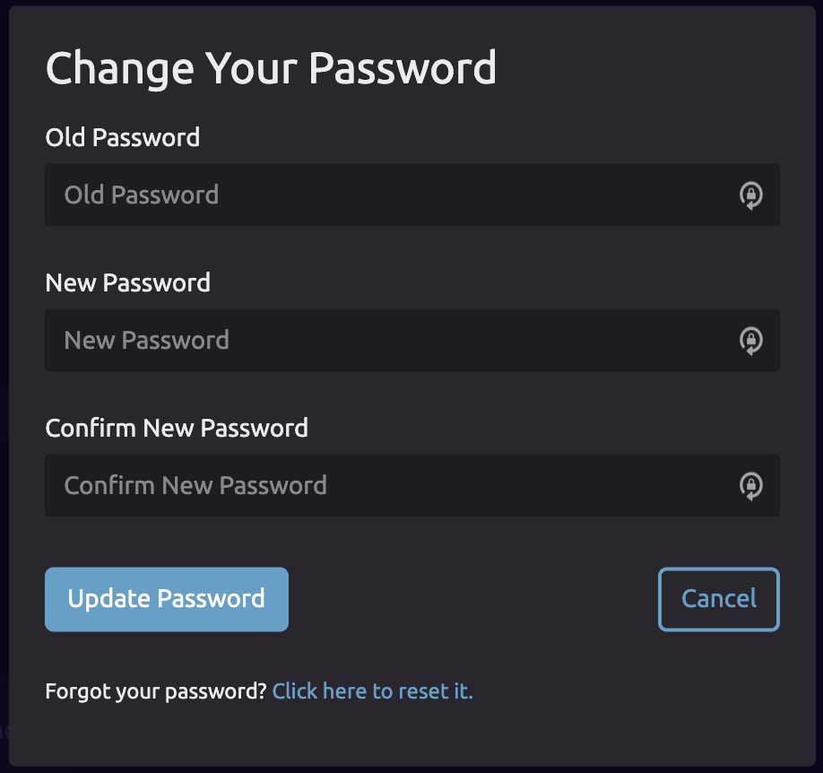

# Changing Your Password

1. Navigate to the [Account Settings page](https://wayscript.com/settings). 
2. Click "Change Password" under the "Password" section of settings.     
3. You will be shown a dialog where you will need to enter your old password, and enter and confirm the new password. 
4. If you forgot your password, you can reset it from this dialog.

