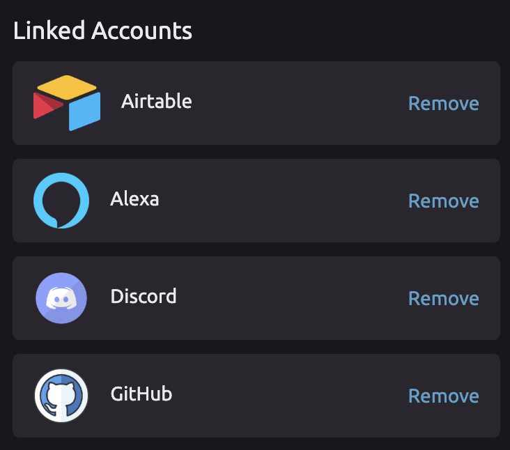

# Managing Your Linked Accounts

## 🔗 Viewing Your Linked Accounts

1. Navigate to your [Account Settings page](https://wayscript.com/settings). 
2. You will see a list of all your linked accounts.   

## ❌Removing Linked Accounts

To unlink your account from WayScript, click the "Remove" button on the account.


You can always re-link any removed accounts by re-authorizing them in the associated module.


