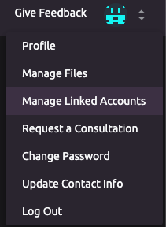
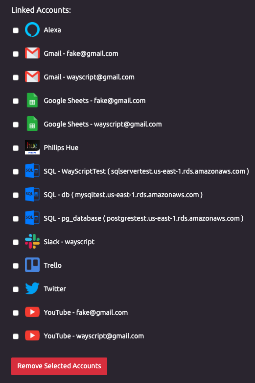
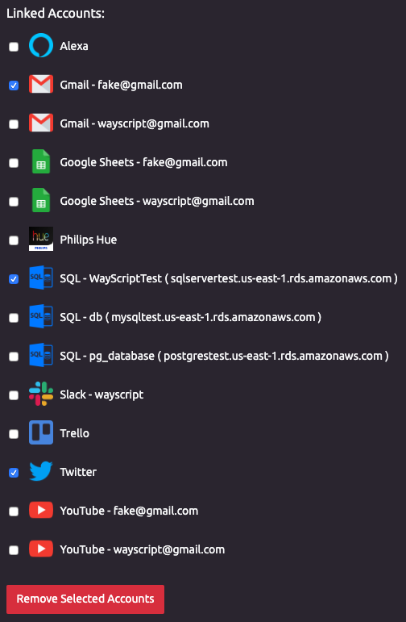
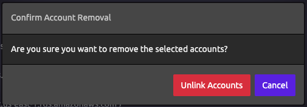

# Managing Your Linked Accounts

## 🔗 Viewing Your Linked Accounts

1. Navigate to the [Manage Linked Accounts](https://wayscript.com/accounts_manager) page.    
2. You will see a list of all your linked accounts.   

## ❌Removing Linked Accounts

1. Click the checkbox next to each account you wish to remove.    
2. Click the "Remove Selected Accounts" button. 
3. You will be asked to confirm the account removal.


You can always re-link any removed accounts by re-authorizing them in the associated module.


