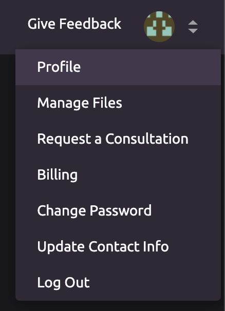
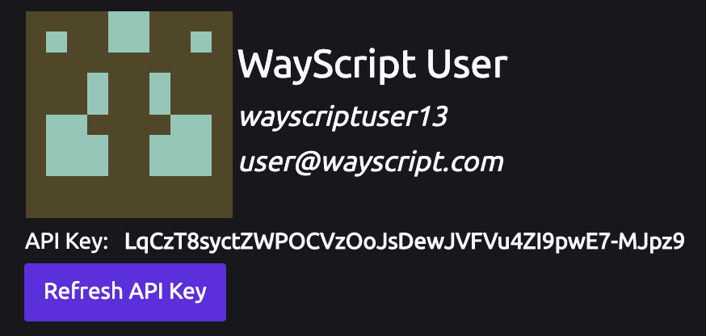
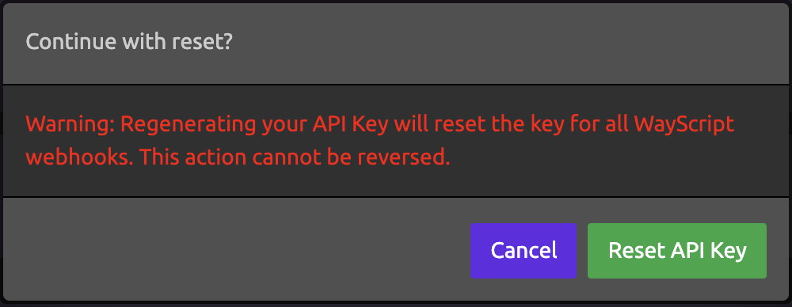

# Managing Your API Key


**Always keep your API Key secret! This can be used to access your account!**


## 🔑 Locating Your API Key

1. Navigate to your profile page:    
2. Your API Key is located in your profile, under your user info.

## 🔄 Resetting Your API Key

To reset your API Key, click the "Refresh API Key" button under the API Key listed in your profile page.

You will see a dialog asking you to confirm the reset. If you reset your API Key, you will need to update any [WayScript API ](../apis/rest.md)calls in your code to use the new key.


Regenerating your API Key will reset the key for all WayScript [webhooks](../library/triggers/webhook-trigger.md). This action cannot be reversed.


