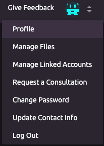
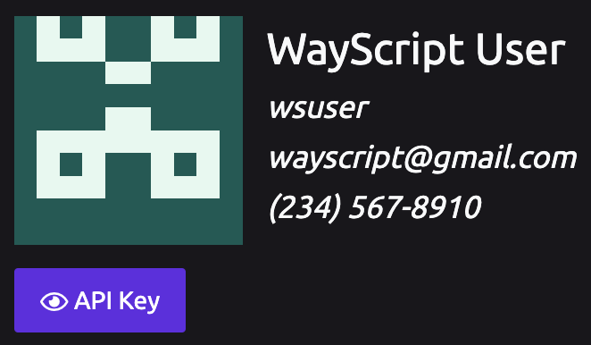
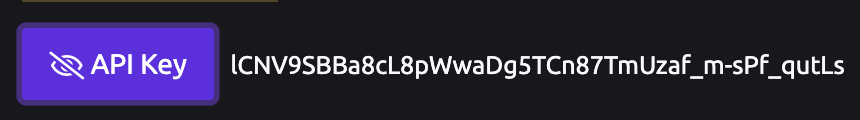
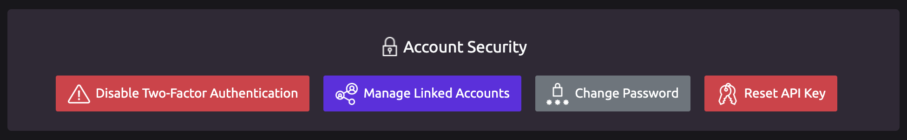

# Managing Your API Key


**Always keep your API Key secret! This can be used to access your account!**


## 🔑 Locating Your API Key

1. Navigate to your profile page:    
2. Your API Key is located in your profile, under your user info. Click the "API Key" button to view your API key.

## 🔄 Resetting Your API Key

To reset your API Key, click the "Reset API Key" button in the "Account Security" section of your profile page.

You will see a dialog asking you to confirm the reset. If you reset your API Key, you will need to update any [WayScript API ]()calls in your code to use the new key.


Regenerating your API Key will reset the key for all WayScript [webhooks](). This action cannot be reversed.


