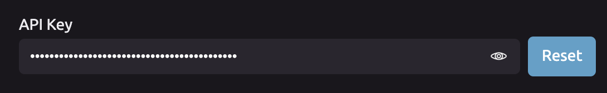

# Managing Your API Key


**Always keep your API Key secret! This can be used to access your account!**


## 🔑 Locating Your API Key

1. Go to your [Account Settings page](https://wayscript.com/settings).  
2. Scroll down to view your API Key. \(Click the eye icon to toggle visibility.\)

## 🔄 Resetting Your API Key

To reset your API Key, click the "Reset" button next to your API Key.

You will see a dialog asking you to confirm the reset. If you reset your API Key, you will need to update any WayScript api calls in your code to use the new key.


Regenerating your API Key will reset the key for all WayScript webhooks. This action cannot be reversed.


