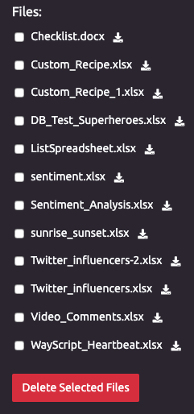
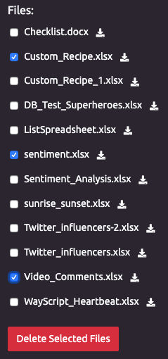

# Managing Your Files

## 🗄 Accessing Your Uploaded Files

1. Navigate to the [Manage Files](https://wayscript.com/file_manager) page.    
2. You will see a list of all your uploaded files.    
3. Click the  \(download\) button to the right of a file to download it.

## ❌ Deleting Files

1. Click the checkbox next to each file you wish to delete.    
2. Click the "Delete Selected Files" button. 
3. You will be asked to confirm the deletion.


**Deleted files cannot be recovered!**


