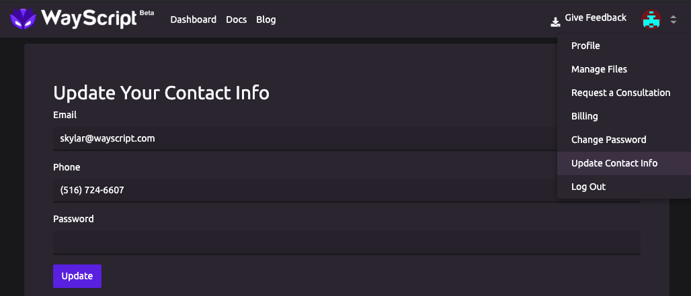
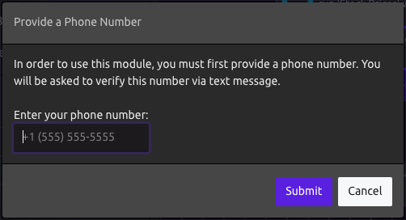
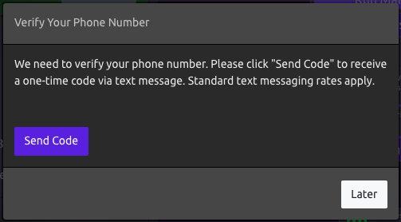
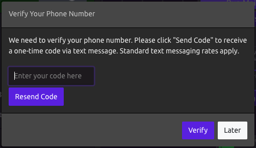

# Phone Number Verification

## How to Find

1. When you first drag in a module that requires a linked phone number \(Text Message, [Text Message Trigger](../program-components/triggers/text-message-trigger.md)\). You will be prompted to verify your phone number. 
2. Use the Account Dropdown in the Navbar to and select 'Update Contact Info'.

## Verification Process

First, enter your number in the "Provide a Phone Number" dialog when prompted.

Next, in the "Verify Your Phone Number" dialog, click "Send Code" to receive a one-time verification code via text message. \(Standard text messaging rates apply\).

Last, once you receive the code, enter it in the "Verify Your Phone Number" dialog and click "Verify".


You can update this number later from 'Update Contact Info' as shown above.


