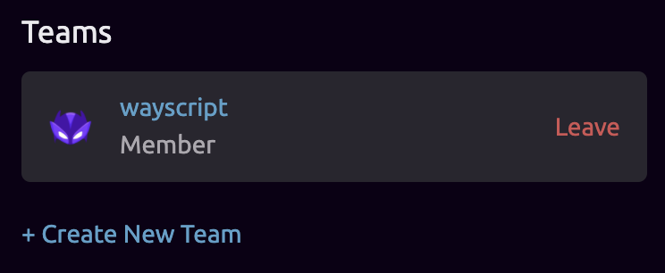
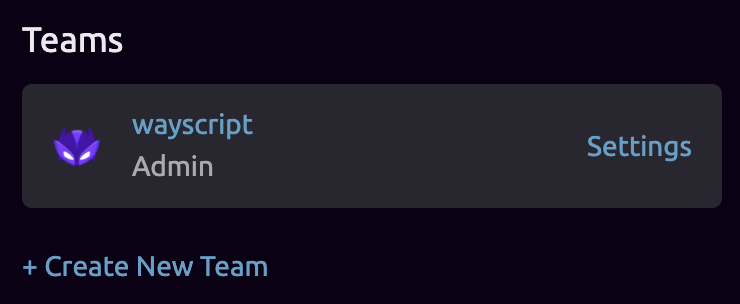

# Team Management

## 👥 Creating a Team

To create a new team, simply click the **+** icon in the Teams section of your user profile page, or click **+ Create New Team** on your [user settings](https://wayscript.com/settings) page.


The user who creates the team will become the admin of the team.


## 💌 Inviting Team Members

To invite new members to a team, the team admin can click the **+** icon in the "Team Members" section of the team's profile page. Admins can also click **+ Add Team Member** from the team's settings page.

## ⚙ Managing a Team's Settings

Team admins will be able to access Team Settings from either the team's profile page, or the admin's [user settings](https://wayscript.com/settings) page.

Once on the team settings page, team admins can add or remove team members, as well as manage team files and linked accounts.

## 🔒 Script Access

All users in the team will be able to view, edit, and run the team's scripts. More granular permissioning is coming soon!

