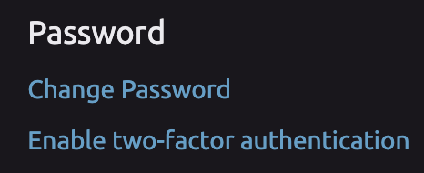
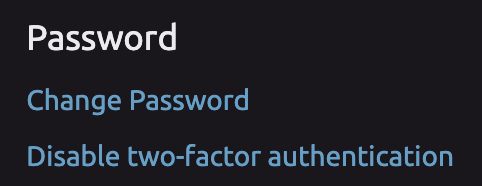

# Two-Factor Authentication

## 🔐 Enabling Two-Factor Authentication


In order to enable two-factor authentication, you must first provide your phone number. See [Adding a Phone Number.](phone-number-verification.md#adding-a-phone-number)


1. Navigate to your [Account Settings page](https://wayscript.com/settings).    
2. Click the "Enable two-factor authentication" button in the "Password" section of settings.      
3. If you have not yet added a phone number, you will be prompted to do so.   
4. Click "Send Code" in the "Enable Two-Factor Authentication" dialog to receive a one-time code via text-message.     
5. Enter the code you receive and click "Enable Two-Factor Authentication."   
6. When you login to WayScript, you will now be prompted for a code.

## 🤝 Trust a Computer

When logging in, you have the option to "Trust this computer." This will prevent Two-Factor Authentication prompts from appearing on that device for up to one month.

## ⚠ Disabling Two-Factor Authentication

1. Navigate to your [Account Settings page](https://wayscript.com/settings).    
2. Click the "Disable two-factor authentication" button in the "Password" section of settings.   
     

3. Click "Send Code" in the "Disable Two-Factor Authentication" dialog to receive a one-time code via text-message.   
4. Enter the code you receive and click "Disable Two-Factor Authentication." 

