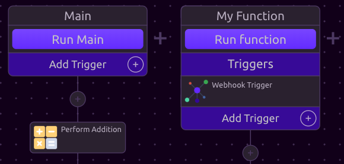

# REST API

## \*\*\*\* **Add a Webhook Trigger**

In order to trigger WayScript programs with an api call, you must first add a [Webhook Trigger](../library/triggers/webhook-trigger.md) to your program.




You can add a different Webhook Trigger to every function if you like, but only one Webhook trigger per function. \(See [Trigger Restrictions](../library/triggers/#trigger-restrictions).\)



If you do not specify a function name in your request and your program has multiple functions with Webhook Triggers, you will be asked to specify which function you would like to run.




Run Program










Your WayScript API Key.



The ID of the program you would like to run.



Variables that you want to pass to your program. You can append as many of these as your program takes. \(See below.\)



The name of a specific function that you want to run.



Run this program asynchronously. \(See below.\) Defaults to `False`.










```javascript
{
    "Success":"Program finished.",
    "Result":[]
}
```






For instructions on finding your WayScript API Key, see [Managing Your API Key](../account-management/managing-your-api-key.md).


### 💡 Examples

#### Run a Program



```bash
curl -X POST 'https://wayscript.com/api?api_key=YOUR_API_KEY&program_id=1234'
```



```bash
{"Success":"Program finished.","Result":[]}
```



**Variable Inputs**

You can optionally input new variable data into your WayScript programs from your api call by appending one or more `variables` URL params to your request.



```bash
curl -X POST 'https://wayscript.com/api?api_key=YOUR_API_KEY&program_id=1234&variables=Foo&variables=Bar'
```



```bash
{"Success":"Program finished.","Result":[]}
```




Variables must be submitted in the same order as the Outputs defined on the Webhook Trigger.


**Running a Specific Function**

You can optionally specify which function within your program you would like to run by passing the function name via the `function` ****URL parameter.



```bash
curl -X POST 'https://wayscript.com/api?api_key=YOUR_API_KEY&program_id=1234&function=My%20Function'
```



```bash
{"Success":"Program finished.","Result":[]}
```




If you do not specify a function name in your request and your program has one function with a Webhook Trigger, the function with the Webhook Trigger will run.



The function you specify **MUST** have an _active_ Webhook Trigger.


**Running Your Program Asynchronously**

Typically, your program will run synchronously and your request will not return a result until the program has completed. 

However, you can optionally add the `run_async=True` URL param to your request to trigger a non-blocking program run.



```bash
curl -X POST 'https://wayscript.com/api?api_key=YOUR_API_KEY&program_id=1234&run_async=True'
```



```bash
 {"Success":"Program started."}
```




Note that the response in this case is _"Program started"_, as opposed to _"Program finished."_


