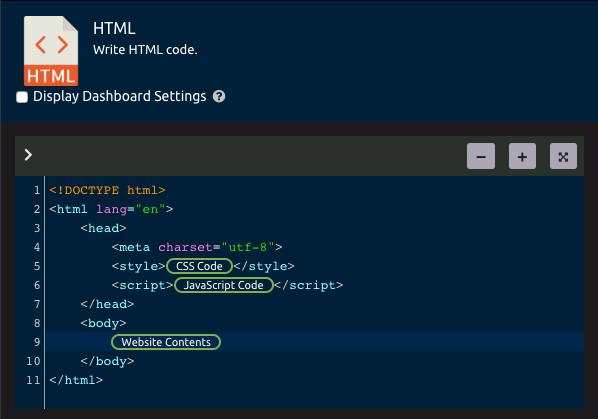
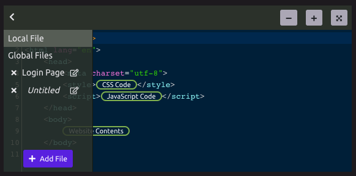

# Code Editors

The ability to include code steps in your script allows power-users ultimate flexibility. With WayScript you can query your [SQL](../library/modules/sql.md) database, manipulate data with [Python](../library/modules/python/) or even build a website with [JavaScript,](../library/modules/javascript.md) [HTML](../library/modules/html.md), [CSS](../library/modules/css.md).


[Build a website with WayScript.](https://www.youtube.com/watch?v=OrZMjdVhFfA&feature=youtu.be)


## Using Variables

Just like most inputs in WayScript, code editors allow you to drag [variables](variables.md) directly into your code. 

## Files

Each code editor, has its own 'local' file, and shares any 'global' files throughout your script with any other steps of the same type.

### Accessing Files

To work with files, click the chevron in the top-left corner of the code editor. You can add new global files for easy access throughout your script.

## Full Screen Mode

For a better coding experience click the arrows at the top-right of your editor to enter full-screen mode.

## Code Steps

* [CSS](../library/modules/css.md)
* [HTML](../library/modules/html.md)
* [JavaScript](../library/modules/javascript.md)
* [Python](../library/modules/python/)
* [SQL](../library/modules/sql.md)

