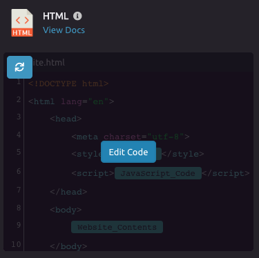
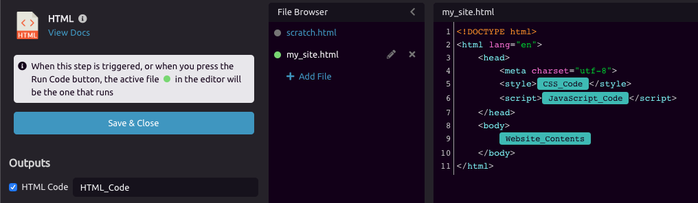
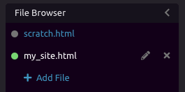

# Code Editors

The ability to include code steps in your script allows power-users ultimate flexibility. With WayScript, you can query your [SQL](../library/modules/sql.md) database, manipulate data with [Python](../library/modules/python/) or even build a website with [JavaScript,](../library/modules/javascript.md) [HTML](../library/modules/html.md), and [CSS](../library/modules/css.md).


Learn how to [build a website with WayScript.](https://www.youtube.com/watch?v=OrZMjdVhFfA&feature=youtu.be)


## ✒ Editing Code

In a module with a code editor, click the "Edit Code" button to open the full-screen editor.

##  Using Variables

Just like most inputs in WayScript, code editors allow you to drag [variables](variables.md) directly into your code. 

## 🗄 Files

Each code editor, has its own local file, called "scratch," and shares any global files throughout your script with any other steps of the same type.

### 📂 Accessing Files

To work with files, open the "File Browser". You can add new global files for easy access throughout your script. You also use the File Browser to select the file that you would like this module to run.


When a step is triggered, or when you press the "Run Code" button, the active file in the editor, indicated by the green dot, will be the one that runs.


## 👩💻 Code Modules

* [CSS](../library/modules/css.md)
* [HTML](../library/modules/html.md)
* [JavaScript](../library/modules/javascript.md)
* [Python](../library/modules/python/)
* [SQL](../library/modules/sql.md)

