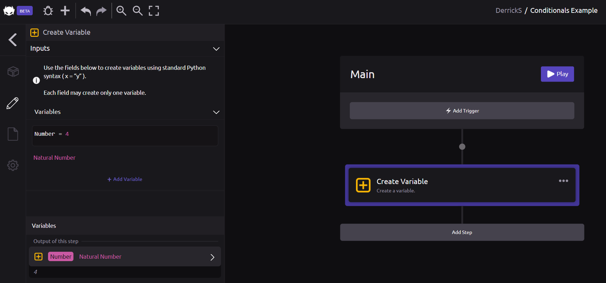
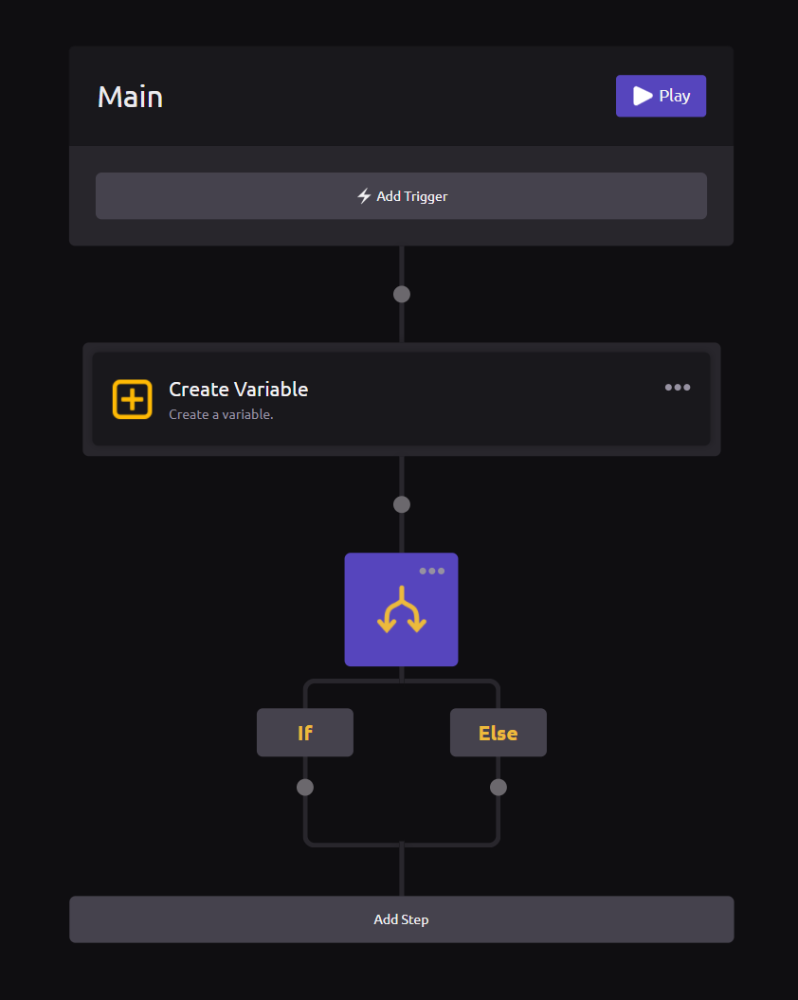
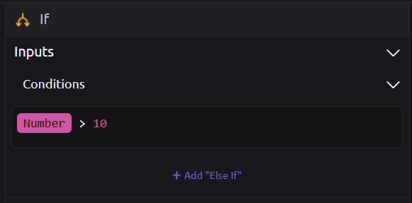
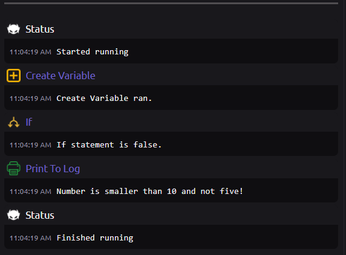

# Conditionals


Please read the [Hello World](hello-world.md) and [Variables](variables.md) sections before continuing with this section.



For a full list of conditions for each variable type, read the [Conditionals ](../library/logic/conditionals.md)[logic Documentation](../library/logic/conditionals.md).


## What is a condition?

In programming, a conditional \(also known as "[if-statement](../library/logic/conditionals.md#if-else)"\) is a control-flow statement directing your program to perform different actions depending on whether or not the programmer-specified _condition_ is `true` or `false`.

## 🌟 Creating Conditions in WayScript


###  Create a Variable

For this example, we create a variable called Number and set it to the value 4.



###  Add an If Statement

Drag the "If" module from your Logic Panel as the next step in your program.



### ⚙ Define Your Conditions

Your conditions are defined by using python syntax:

```text
Number == 4     #Check if Number is Equal to 4
Number != 4     #Check if Number is Not Equal to 4
Number > 4      #Check if Number is greater than 4
Number < 4      #Check if Number is less than 4
Number >= 4     #Check if Number is greater than or equal to 4
Number <= 4     #Check if Number is less than or equal to 4
```

In this example, let's check to see if our number is greater than 10. Our conditional statement would look like this within the editor:



### 🌵 Add Branches

We can also add additional branches to our conditional as Else-If branches. The first branch which is **True** will execute. If no branch is **True** then the **Else** branch will execute. 


In this example, since our Number variable is equal to 4. We first check the if branch \(furthest to the left\) and that returns False since 4 is less than 10. We then check if Number is equal to 5. That also returns False. Therefore our else branch returns True.

### 🌲 Add Branch Actions

We can now add different sets of actions to each **branch** of the conditional. If the condition is **True,** it will execute one set of actions, otherwise it will run a different set of actions. We can have as many branches as we want and the first branch that is **True** will execute \(see note above\).


### ▶ Run your Program

Press the "Run Main" button to run your program. You can see that the If-statement evaluated to False \(because 4 is not greater than 10 or equal to 5\). Our program prints "Number is smaller than 10 and not 5!".



Try changing the number of your Number variable and rerunning the program.


For a full list of conditions for each variable type, read the [Conditionals Logic Documentation](../library/logic/conditionals.md).


