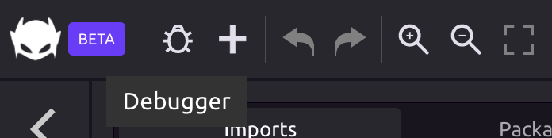
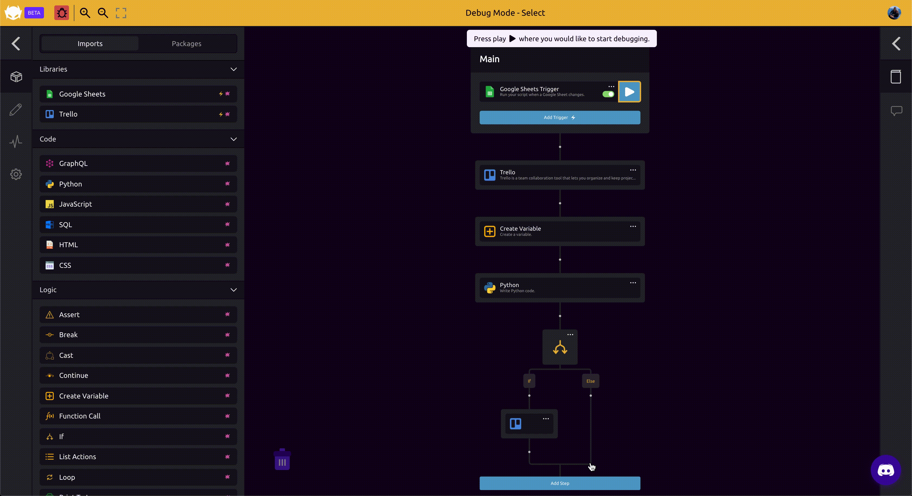
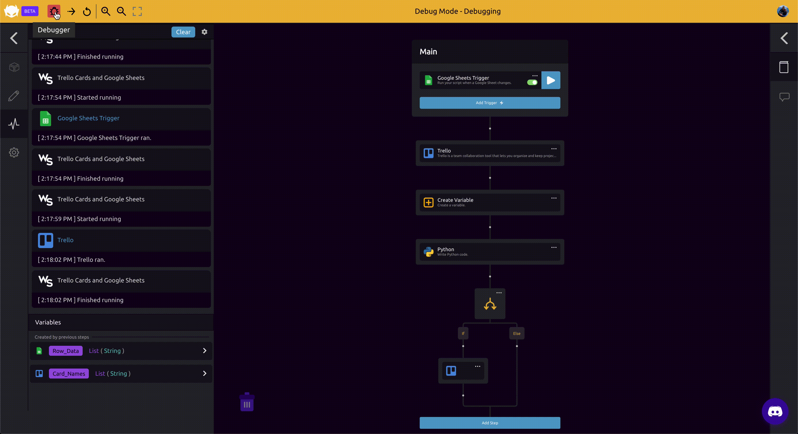

# Debugging

## 🐞Starting the Debugger

To start the debugger, click the "Bug" icon in the toolbar.

 

▶ Press play where you would like to start debugging.

## 👟Stepping Through Your Script

Click the "Step Forward" arrow to start stepping though your script. Click the arrow again to advance to the next step. Click the "Reset Debugger" arrow to go back to the beginning of your script.


When you reach the end of your script, the debugger will go back to the beginning.


## 🛑Exiting the Debugger

Click the \(now red\) "Bug" icon again to exit the debugger.

