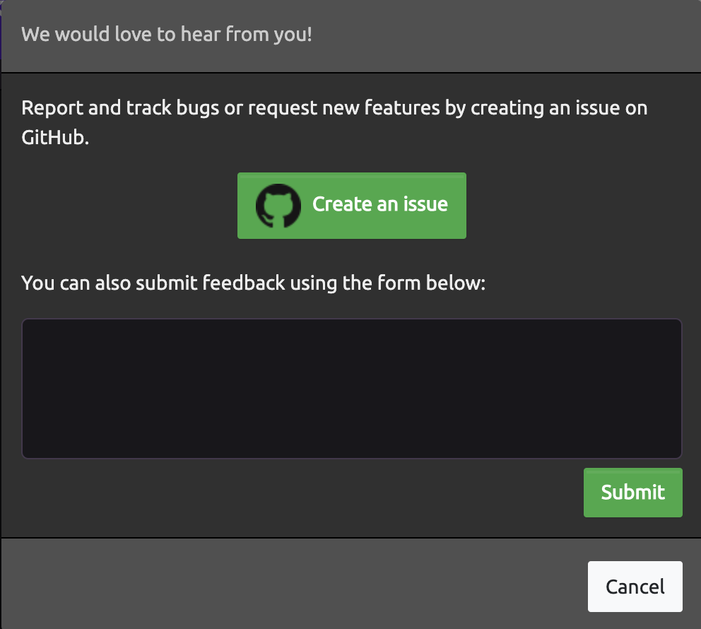

# Feedback and Bug Reporting

## Be a superhero!

Submit bugs, feature requests, or feedback you would like to share with the WayScript team!


WayScript maintains a [GitHub Feedback repo](https://github.com/wayscript/feedback), where you can submit bugs, feature requests, or feedback you would like to share with the WayScript team.


### Submitting Feedback

To leave feedback or to report a bug, click the "Give Feedback" button on the navigation bar:  
  

You will then be presented with a modal giving two options:

1. Report and track bugs or request new features by [creating an issue on GitHub](https://github.com/wayscript/feedback/issues/new/choose).  

   🌟 Submitting your feedback on GitHub allows you to track its progress and discuss the issue with the WayScript team and community! 🌟   

2. Submit feedback using the form in the modal.

