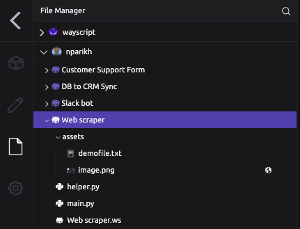
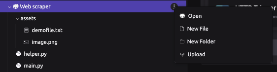
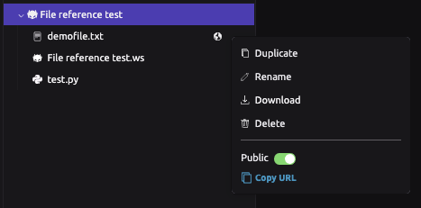
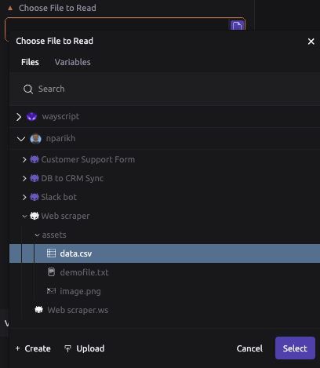

# File System

WayScript's File System is attached to each script you build on the WayScript platform. Navigate to the File System in the WayScript editor to browse your script's file directory, and create or upload a file as a persistent resource \(just like on your local machine!\) that you can reference in any module of your script. 


Check out our [tutorial](https://www.youtube.com/watch?v=oCufjwXufs0) on how to get started with the File System.


## 🔍 Accessing the File System

The WayScript File System is always available through through the left menu in the script editor. 



### Structure

* Each of your scripts on WayScript automatically generate a folder with the same name as the script title. This folder can not be renamed or deleted.
* Scratch files generated through WayScript's Code modules are stored in a `.ws` file with the same name as the script title. This file cannot be renamed or deleted.
* You may create additional folders within each script folder to organize your files. 

### Uploading and Creating Files / Folders



* You can use the overflow menu on any file to upload or create a new file or folder. 
* WayScript supports most major file formats. However, you can only edit a select list of text-based formats and preview a select list of image and document formats. 

## 🔗 Referencing Files

Our File Actions module allows you to create a WayScript File Variable, which can then be used in other modules. For example, you create a WayScript File Variable with an HTML file and then pass to a HTTP Response module.

### File Scoping

* By default, files are stored at the script-level inside a folder with the same name as the script. Files contained  in this folder can only be referenced by modules and other files also located within this folder. 
* Files can also be stored in your account-level folder. These files can be referenced by any script in your account. 
* **Note:** The same scoping is true for files stored under a Team account. 
* Files can be referenced outside of the WayScript platform by making them public. This will generated a static URL that references the file. 



### Referencing Files within Code



A file located in your script directory can be referenced in the following ways. 

* `f = open('demofile.txt', 'r')` OR
* `f = open('/<username>/<script_name>/demofile.txt', 'r')`

You can also import functions or classes between Python files located in your script directory, e.g.:

```text
# import_test.py
def testFunction():
    return("Hello World")
    
# main.py
from import_test import testFunction
print(testFunction())
```



A file located in your script directory can be referenced in the following ways. 

* `File myObj = new File("demofile.txt");` OR
* `File myObj = new File("/<username>/<script_name>/demofile.txt");`

You can also import methods between Java files located in your script directory, e.g.:

```text
# Other.java
public static void testMethod()
{
 // code to be executed....
}

# Test.java
Other.TestMethod();
```



Currently, files cannot directly be referenced by their file-path through HTML `src` attribute. However, you can make files public to generate a static URL that references the file, as shown below. 

``



* You can use basic file directory and manipulation Shell commands, such as `ls`, `cd` , and `mkdir`, to interact with the WayScript File System. 
* The current directory is always set initially within your script folder. 



### Referencing Files within Modules

Many of WayScript's modules offer a way to select a file from the File System to read in as an input or write to as an output. 

For example, in the [CSV](../library/modules/csv.md) module, choosing a file to read opens a view of the File System which allows you to select the right file, create a new file, or upload a file from your local environment. This selector will only permit you select a supported file format for that corresponding module. 



