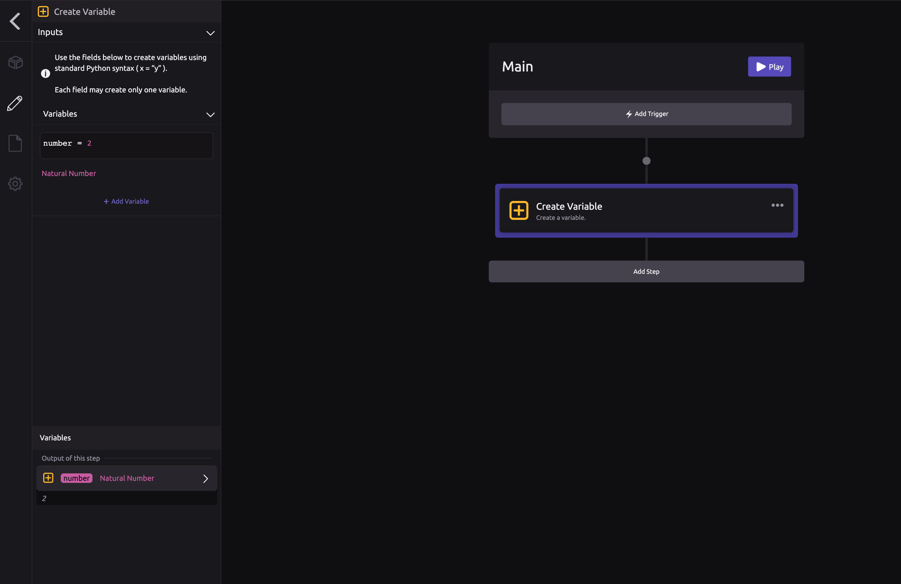
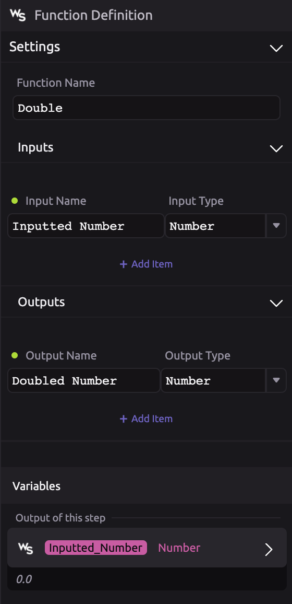
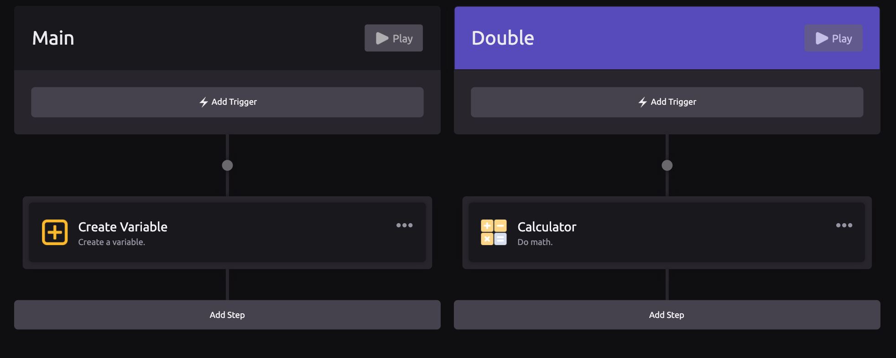
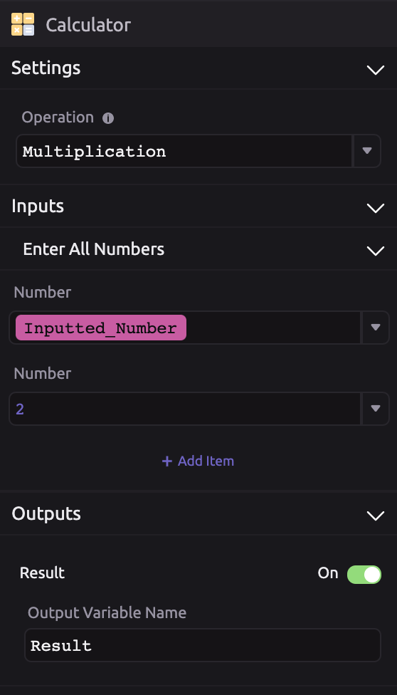
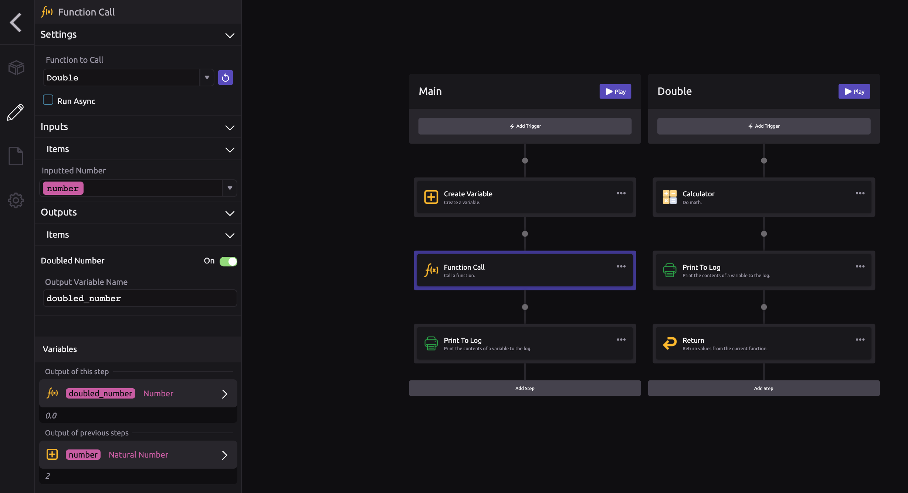
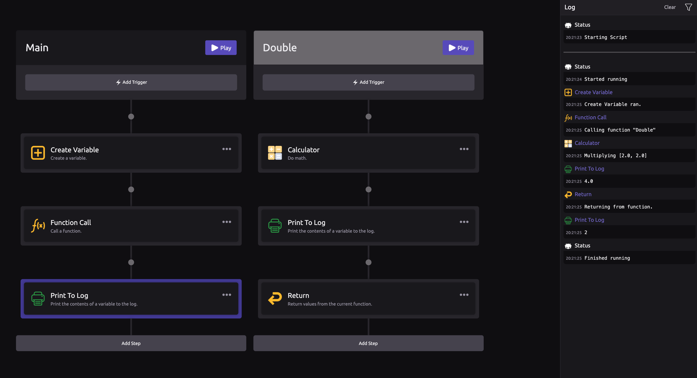
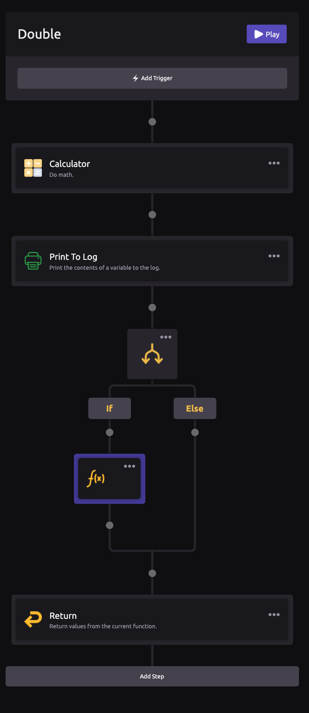

# Functions


Please read the [Hello World](hello-world.md), [Variables](variables.md), [Modules](modules.md), and [Program Flow](program-flow.md) sections before continuing with this section.



For full details on functions, read the [Function Logic Documentation.](../library/logic/functions/)


In this introduction to functions, we are going to build a script that uses functions.

🧩 Functions are useful for breaking up your code into more manageable, reusable pieces.

## What is a function?

> "A function is a block of organized, reusable code that is used to perform a single, related action. Functions provide better modularity for your application and a high degree of code reusing." - [TutorialsPoint](https://www.tutorialspoint.com/computer_programming/computer_programming_functions)

## 🎓 Building Functions Tutorial

In this tutorial, we are going to build functions that let us do some simple math.

###  Step One - Create a Variable

[Create a Number Variable](variables.md) called "Number" and set it to the value 2.


Be sure to set the [Type of Item](../library/logic/create-variable.md#define-the-characteristics-of-your-variable) to Number


###  Step Two - Create a Function

Now, we are going to write a function that doubles our number. [To add a function, press the + button next to your workflow branch to generate a new branch](../library/logic/functions/#creating-a-new-function).

Next, click on the name of the function \("My Function"\) to enter the setup for that function.

We are going to name our function "Double" because it will double our number. Its **input** will be our 'Number' variable which we will call "Input Number", and its **output** will be the number \* 2. We will call this output "Doubled Number". Make sure to set the Input and Output Types to Numbers.

### 🏗 Step Three - Build Your Logic

The goal of the 'Double' function is to double our 'Input Number' and return that result to the 'Main' function as our "Doubled Number"

To do this math, we are going to use the [Calculator Module](../library/modules/calculator.md). Drag the Calulator into your function branch.

Now, we set up our calculator to multiply our Inputted Number by 2. We name the output "Doubled Number".

To show the power of functions, we are going to print the value of "Doubled Number" from within the function, then we are going to pass the value of Doubled Number back to our Main branch so we can use it at further steps. To do this, we use the [Return](../library/logic/functions/return.md) module.


If you [define outputs](functions.md#step-two-create-a-function) in your function setup, you must return or your script will throw an error.


Your returned value is now a variable in your main branch \(the branch that called the function\).

Now run your script and read the log to see the [Program Flow](program-flow.md)

## 💡 Advanced Features

### 🔄 Recursion

WayScript allows for recursive function calls. Referring to the example above, the 'Double' function can call itself.

In this example, if the Double Number variable is less than 10, the Double Function calls itself. With this setup, the function will recurse until the Doubled Number is greater than 10 and then will return the Double Number value \(16\) back to the Main branch.

