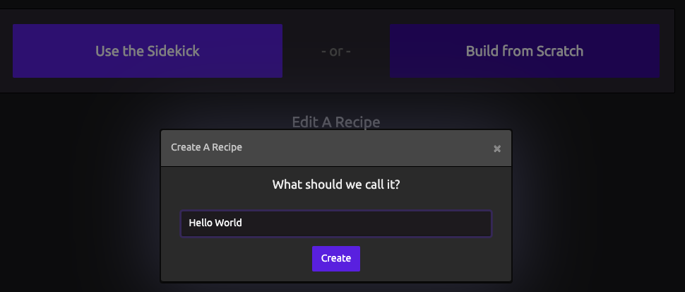
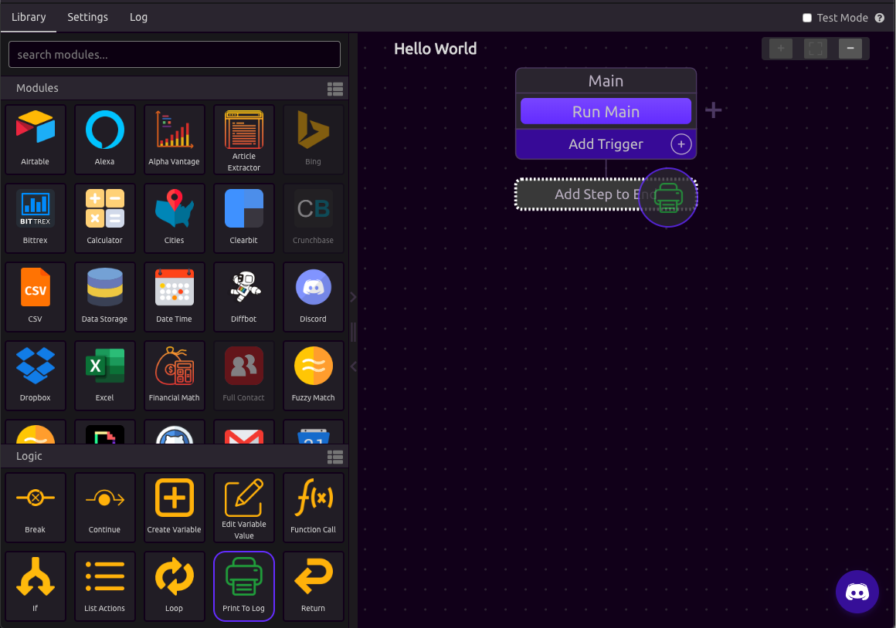
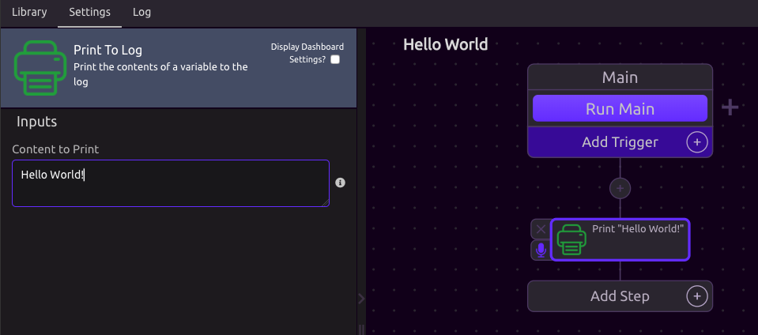
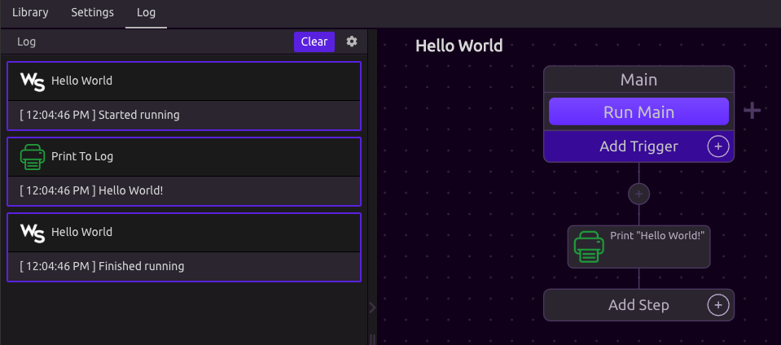

# Hello World

## Creating a WayScript Program

### Initialize a new program

On the dashboard, click **Build from Scratch** and name your program 'Hello World'. Press **Create** to start building your program.

When you press Create, you are brought into the WayScript program builder.

### Print to Log

Drag the '[Print To Log](../library/logic/print-to-log.md)' [Module](../library/modules/) from your [Logic](../library/logic/) panel to your Flow Diagram.

Enter 'Hello World!' as the input to the [Print to Log](../library/logic/print-to-log.md) module.

### Run your Program

**Press the Run Main button** to run your program on the cloud. 'Hello World!' will print to the program log.

**Congratulations** on running your first WayScript program!

