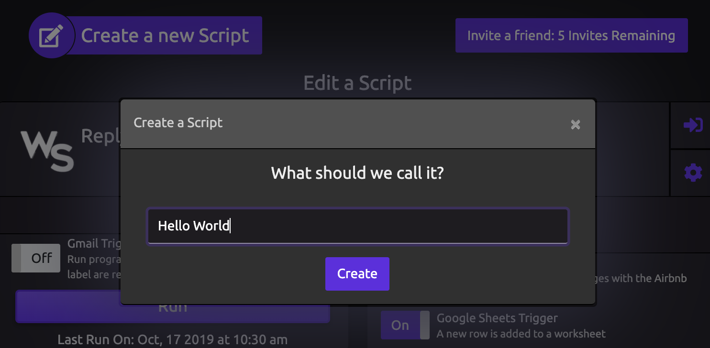

# Hello World

##  Creating a WayScript Program

### 🌏 Initialize a New Script

On the dashboard, click **Create a new script** and name your script 'Hello World'. Press **Create** to start building your script.

When you press Create, you are brought into the WayScript program builder.

### 🖨 Print to Log

Drag the '[Print To Log](../library/logic/print-to-log.md)' [Module](../library/modules/) from your [Logic](../library/logic/) panel to your Flow Diagram.

Enter **'Hello World!'** as the input to the [Print to Log](../library/logic/print-to-log.md) module.

### ▶ Run Your Program

**Press the Run Main button** to run your program in the cloud. 'Hello World!' will print to the program log.

\*\*\*\*🎉 **Congratulations** on running your first WayScript program!

## 📖 What's Next?

Now that you've learned the basics, check out these articles for more in-depth tutorials:

* [Variables](variables.md)
* [Program Flow](program-flow.md)
* [Modules](modules.md)
* [Triggers](triggers.md)
* [Looping / Iteration](looping-iteration.md)
* [Conditionals](conditionals.md)
* [Functions](functions.md)

