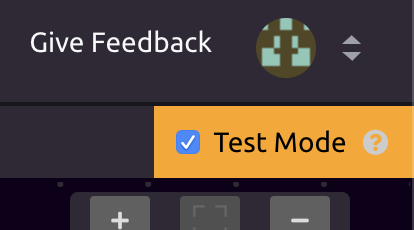
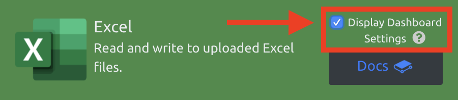
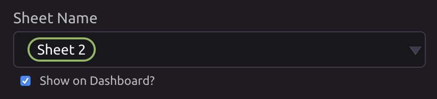
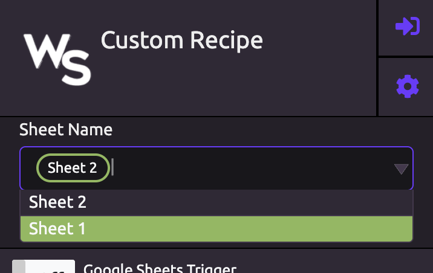

# Helpful Settings

## Test Mode

Modules return dummy data when Test Mode is activated.


Test Mode is useful when you want to avoid making API calls while building and testing the logic of your program.


### Enabling Test Mode

To enable Test Mode while editing your program, click the check box in the top right corner of the screen.


Remember to disable Test Mode when you want to start consuming real data!


## Display Dashboard Settings

When editing a module in the Settings panel, in the top right corner of the module header is a toggle labeled "Display Dashboard Settings."

Enabling this toggle displays a "Show on Dashboard?" check box under every setting, input, or output of the module that supports Dashboard display.

When the "Show on Dashboard" toggle is enabled for a setting, that module setting will then appear in the program's tile on your Dashboard.


You can now edit the value of this field from the Dashboard without needing to go into the program!


