# Modules

Modules are the building blocks of WayScript programs.

In this section, we provide an explanation on how to think about WayScript modules, how they work, and how you can use them to do awesome things with your programs.


Please read the [Hello World](hello-world.md) and [Variables](variables.md) sections before continuing with this section.



Check out the [Modules](../library/modules/) section of the Docs for detailed information on each WayScript module.


## What is a Module?

🤖 WayScript modules give you the ability to automate tasks and actions using third party applications.

🏭 The easiest way to think of a Module is like a station on an assembly line. First, you **setup** your station to your specifications, then you **input** the necessary components, work is done, and finally you get a shiny new **output**.

📦 WayScript integrates third party APIs allowing you to leverage these applications and tools as steps in your assembly line.

📧 As an introduction, we are going to build a program that pulls the current temperature for a location and sends you an email with the data.  

## ☝ Select Your Module

In order to get the temperature, we are going to use the [Weather API Module](../library/modules/weather-api.md). ****Select this module from your Modules Panel and drag it into your flow diagram. 

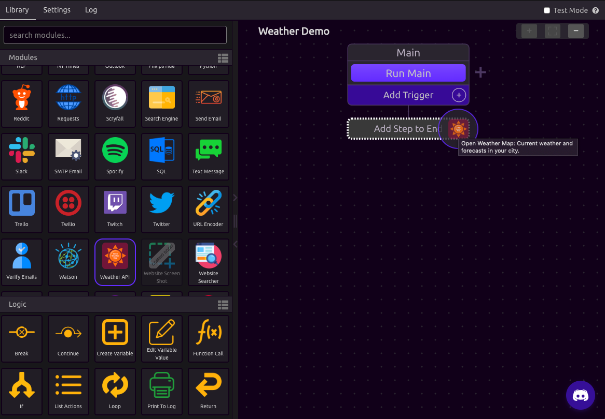

## ✨ Setup Your Module

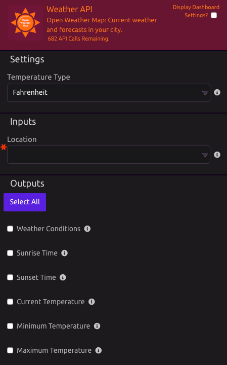

Notice the three sections of this module - Settings, Inputs, and Outputs. When setting up a module, you should start from the top and work your way down to the bottom. 

### ⚙ Settings

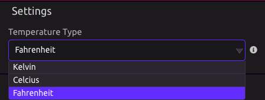

Under Settings, we set up the options for our Module. In this case, the Weather API Module wants to know if we want our results returned in Fahrenheit, Celcius, or Kelvin.


If the module requires authentication \(for example, Gmail requires you to log in using your Google account\), there will be a dropdown at the top of the settings panel to select or add an account. Click "Add an Account..." from the dropdown and follow the steps to authenticate your account. You can delete an authenticated account by selecting it from the dropdown and hitting the edit button, then clicking the delete button in the dialog.


### 📥 Inputs

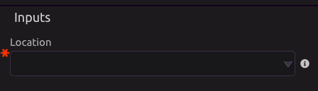

In the Inputs Section, the module requires a [Location](../library/modules/weather-api.md#inputs): the location to find the temperature for. This is comparable to being on a weather website and typing in your location to get the forecast. 


The red asterisk indicates that his is input is **required** for the module to run.


There are two options for correctly setting up your Location input.

#### Insert a Variable

We can [create a text variable](variables.md) _before_ the Weather Step in our program flow. Once again think about an assembly line - the variable needs to be created before it can used by a future step in the program. If we do that, the variable will become accessible to us in the input dropdown. 

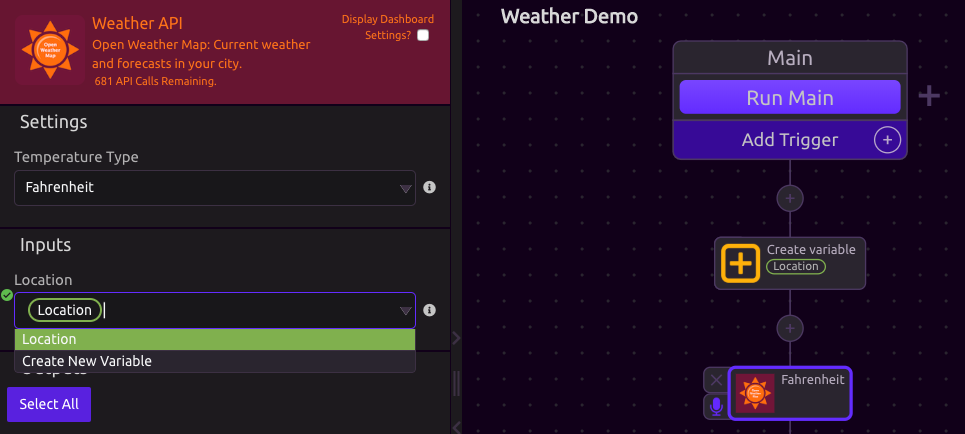

#### Hardcode a Value

A second option is to just type in the location you are looking for. Hardcoding is a useful feature if you don't need the Location to be a variable. This would be the case if you do not need to reference the variable anywhere else in your program. 

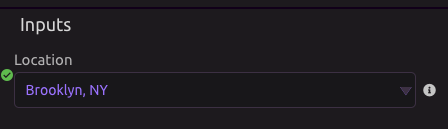

#### A Note on Hardcoding

Yes, you can mix variables with hardcoding! If I [created a variable](variables.md) called "State" and set it to "NY", I could then create the following input:

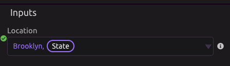

### 📤 Outputs

When you select Outputs from your Module, they become variables that can be used in your program. These variables are like those created in the [Variables Tutorial ](variables.md)in that they can be [single items](variables.md#single-item) or [lists](variables.md#lists), and can be [different data types](variables.md#variable-types) such as text, numbers, dates, etc. Notice below how the selected outputs are now available in the Variables Panel.

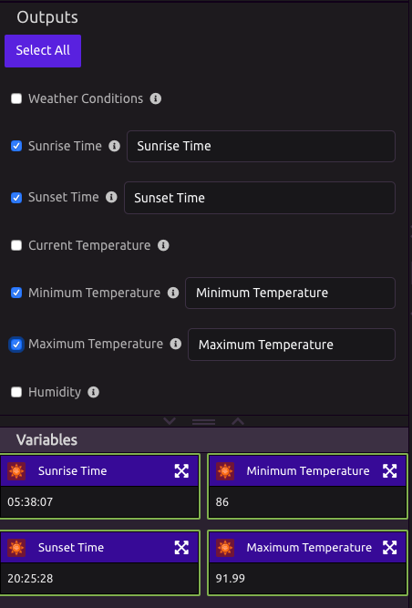

## Remove Module

There are two ways to remove a module.

### Drag to Trash Bin

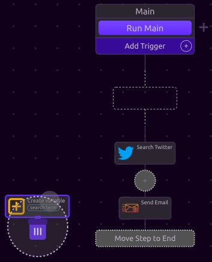

### From Module Drawer

When a module is selected or moused over, the module drawer will appear.

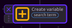

## Disable Module

Disabling a module is convenient way to try out different program setups without having to redo work. When a module is disabled, WayScript will ignore it and any of its sub-steps.

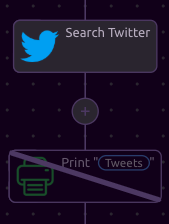

##  Add Comments to a Step

To add comments to a step of your script, click the  \(speech bubble\) icon to the right of the step.

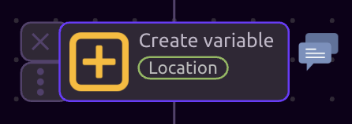

This will open up a panel where you can view, add, and edit comments for that section of your script.

