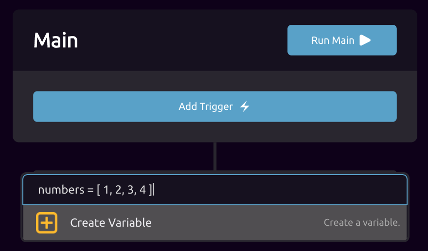

# Power Users

## Editor Hot Keys



| To do this | Press | When |
| :--- | :--- | :--- |
| Open 'Add Step' dialog in leftmost function | Tab | No Inputs Selected |
| Create empty variable 'pill'  | + i | Editing text |
| Undo last action | + z | No Inputs Selected |
| Undo last action | + y | No Inputs Selected |



| To do this | Press | When |
| :--- | :--- | :--- |
| Open 'Add Step' dialog in leftmost function | Tab | No Inputs Selected |
| Create empty variable 'pill'  | Ctrl + i | Editing text |
| Undo last action | Ctrl + z | No Inputs Selected |
| Undo last action | Ctrl + y | No Inputs Selected |



## Editor Power Features

### Create Variable Shortcut

1. Open 'Add Step' dialog.
2. Type variable definition\* in search input.
3. Press 'Enter' to create variable.

\*Not all variable types are supported in this shortcut. Supported types are:

* String
* Number
* List\( String \)
* List\( Number \)

