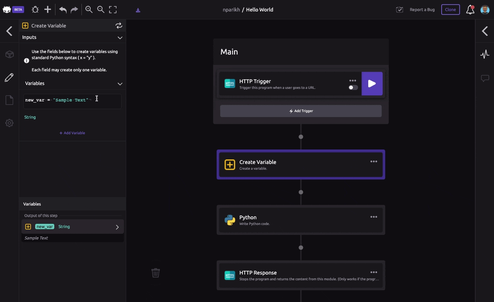
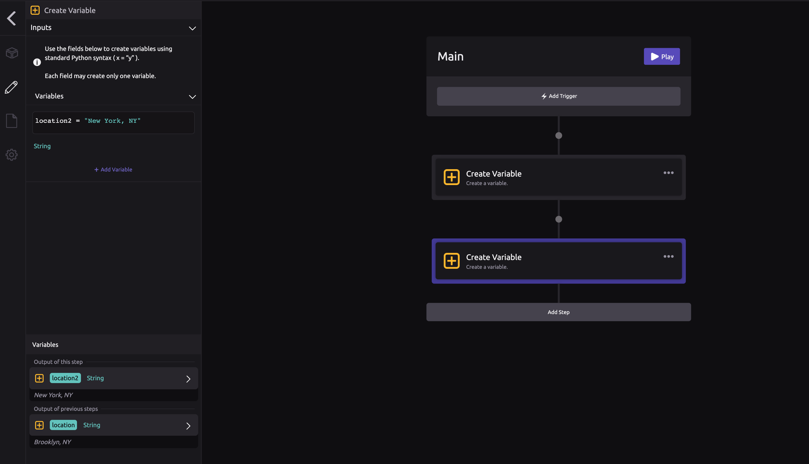
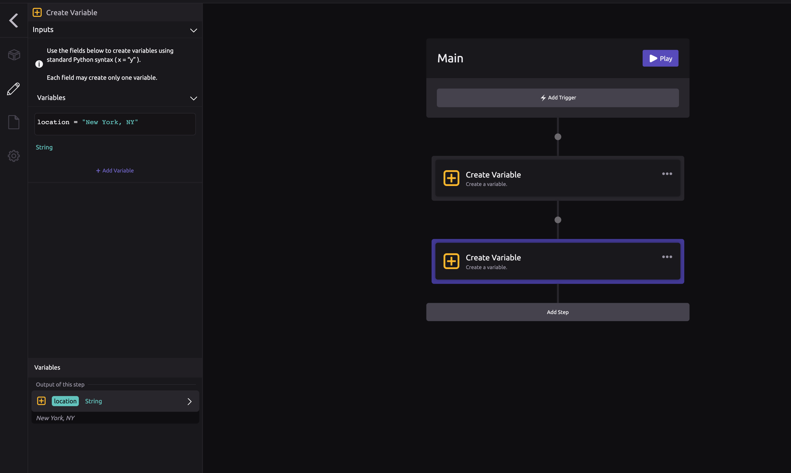

# Script Flow

## 🏃♀ Script Run Order

Your script executes in order. The easiest way to think of this is like each step in your script is a stop on an assembly line. Each station on the assembly line can use anything built at a previous station, but not a later one. Something needs to have been built before it can be used.

If you want to print a variable, that variable needs to have been created _before_ the [Print to Log](../library/logic/print-to-log.md) step.

If you were to switch the order of these two steps, then the 'Location' variable would not be accessible in the Print to Log step because it has not been created yet.

## Step Sync

Each step in your script can hold one of two states:

1. **`In-sync`**: The outputs of the step reflect the latest changes to the selected or previous step settings or code
2. \*\*\*\***`Out-out-sync`**: The outputs of the step do not reflect the latest changes to the selected or previous step settings or code

As you modify Module settings or write code, you will notice the following behaviors \(as shown below\): 

1. Changing Module settings or code on a selected step will result in the step being **`out-of-sync`**. 
2. Every following step will also marked with ato warn you it is **`out-of-sync`**, as its outputs may be impacted by the selected step's changes.  
3. Pressing the sync buttonor using the sync hotkey `s` will update the outputs of the selected step to reflect the latest changes, placing this step **`in-sync`**. 
4. Pressing the sync buttonor using the sync hotkey `s` on each subsequent step will place them **`in-sync`**, or syncing the last step in your script will automatically place all previous steps **`in-sync`**.


As a general rule, syncing a step will place both the selected step and all previous steps in the script run order **`in-sync`**.



Pressing syncon a selected step will execute code within a WayScript code module if it is a previous step, but will not execute sensitive actions from other modules, such as sending a Slack message or writing to a Google Sheet. These actions will only be executed by pressing ▶ on your script trigger or function.


## 🔤 Variable Values

Like in other programming languages - **the names of variables matter**. Therefore, if you create a second variable with the same name, the value of the variable is overwritten.

### 💡 Different Variable Names

In the image below, a new variable, 'Location2' has been created. Therefore, the 'Location' variable with value "Brooklyn, NY" still exists.

### ✏ Overwrite Variable

Below, at step 2, the value of 'Location' is "New York, NY". The starting value, "Brooklyn, NY" was overwritten since the same variable name was used.

