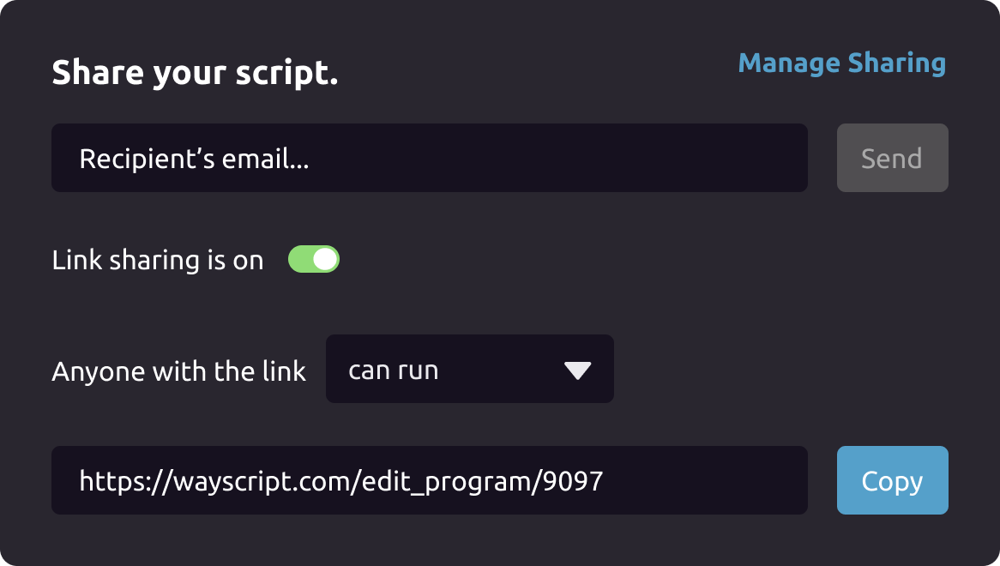
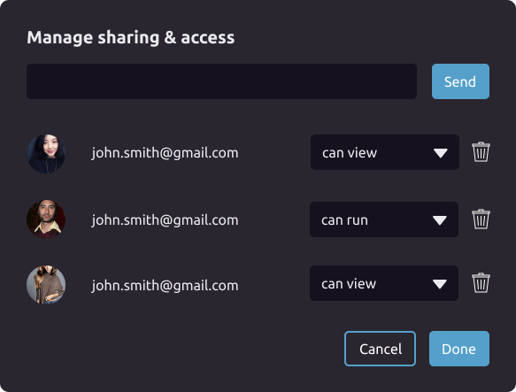

# Sharing

## Sharing your Script

WayScript allows you to share your programs with others via email, or a public link.

To share, simply click the share button in the top right corner of the Script Editor.

In addition to email and link sharing, you can also control run access. "Can view" means users can view, but not run or edit your script. They are however, able to Clone the script to their account so they can use it for themselves.

"Can Run" means the user can run the program from **your** account. That means with any logins or API's you've authenticated, so use with care!

Clicking "Manage Sharing" lets you control which user accounts have access to your script, and their level of permissions. 

That's it! Share scripts with friends or coworkers to help them supercharge their projects and workflows.

