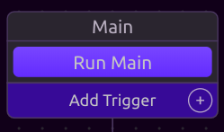
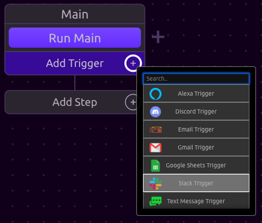

# Triggers

Triggers tell your WayScript program to run.


You can get a full list of all Triggers and their functionality in the [Library](../library/triggers/). 


## What are Triggers?

▶ So far in this introduction, we have run our programs by pressing the "Run Main" button. Whether you realized it or not - this button is a Trigger! 

⚡Trigger events cause your program to run. In the "Run Main" case, the Trigger is just pressing the button. However, there are many other types of triggers you can set up to run your programs.  


A simple example of this is the [Time Trigger](../library/triggers/time-trigger.md).


## ➕ How to Add a Trigger

To add a trigger, press the **+** button next to Add Trigger. 

