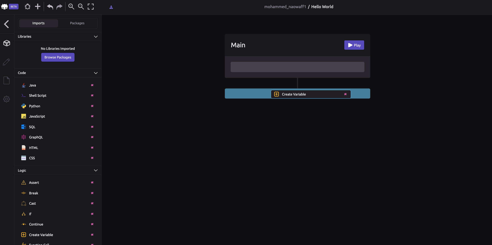
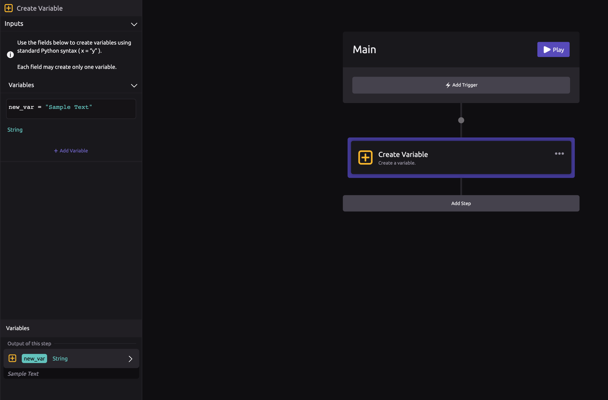
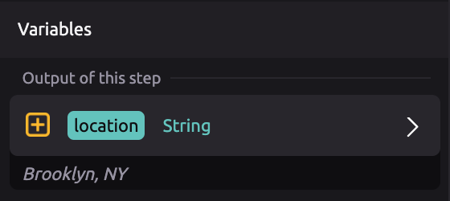
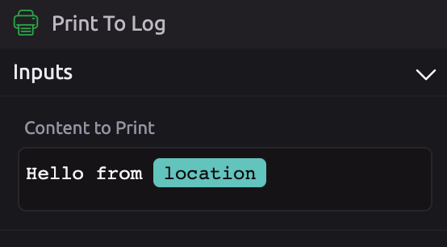
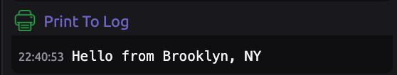
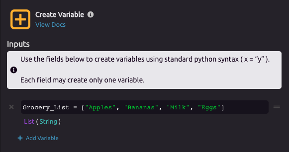
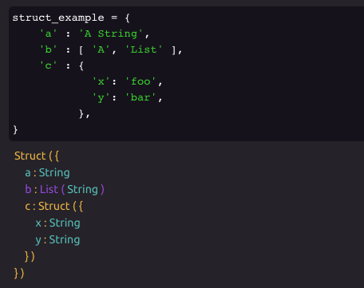
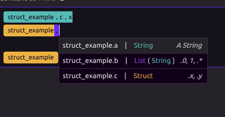
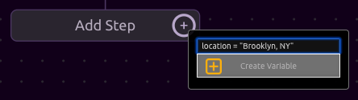
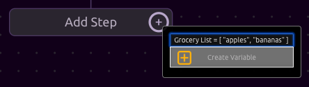

# Variables

## ⚙ Create Variable Setup

Drag the [Create Variable](../library/logic/create-variable.md) module into your program flow diagram.



WayScript will automatically display the Settings Panel for your [Create Variable](../library/logic/create-variable.md) step. This is where you are going to set up your variable.


##
## ⚙ Single Item

For this example, we are going to assign a **Variable Name** called "Location" and set the **Variable Value** to "Brooklyn, NY". Feel free to put in your own location instead.


After setup, your new variable will appear in the **Variables Panel.** You can now use this variable in your program.



### Example of using a Single Item Variable

Your variable is is available for reference at any future step in your program flow. In this example, we can now print a message which contains the Location variable.



You can begin typing the variable name to select it, or you can drag the variable from the Variable Panel into the Content to Print input.



## 📃 Lists

### 💡 What is a list?

A list \(also called an array\) is a data structure used to store multiple pieces of information in an ordered sequence where each has a unique 'position' \(also called index\) in the list. List variables can even store other variables.

###  Creating a List

In this example, we'll create a list with **Variable Name** "Grocery\_List" and add items as **Variable Values.** The use cases for lists will be discussed more in the [Looping](looping-iteration.md) section of the docs.




Your Grocery List is now a variable that can be used in your program.

## Structs

With WayScript, you will often be working with Structs. These datatypes are the equivalent of a [Python Dictionary](https://www.w3schools.com/python/python_dictionaries.asp). Structs allow for nesting and can hold other variables. 



### Querying Variables in a Struct - Dot Syntax

In order to access key/values within the Struct, use our **Dot Syntax**.



You can access values within the struct by using '.' to move to the next level in the struct. 

## Common Variable Types

### String

```python
x = "This is a string"
```

### Number / Float

```python
pi = 3.14
```

### Boolean

```python
yes = True
no  = False 
```

### Null / None

```python
x = None
```

### List

```python
my_list = [1, 2.5, 3, "string"]
```

### Struct

```python
struct = {
    'a' : 'Text',
    'b' : [1, 2, 3 ],
}
```

### Chart

The [Chart Module](../library/modules/chart.md) will output a Chart variable. Chart variables can be placed in a [Dashboard Response](../library/modules/dashboard-response.md), [Print to Log](../library/logic/print-to-log.md), and other places you would expect to view output.


## 💪 Power-User Features

If you know some coding, you can more rapidly build a variable from the module shortcut dropdown by entering the definition directly.

This power-user features matches the syntax of the Python programming language for strings and arrays.






Press tab to open the shortcut dropdown at the end of your program.


