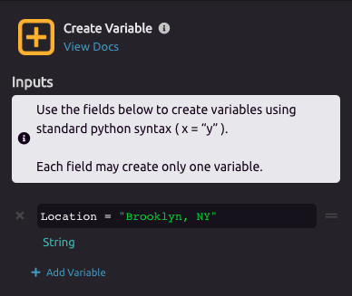
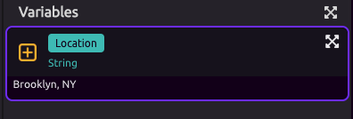
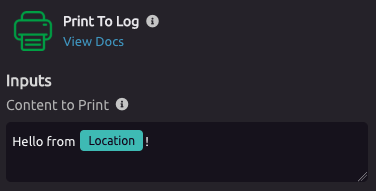

# Variables

## What is a Variable?

> **"Variables** are used to store information to be referenced and manipulated in a computer program. They also provide a way of labeling data with a descriptive name, so our programs can be understood more clearly by the reader and ourselves. It is helpful to think of variables as containers that hold information. This data can then be used throughout your program."
>
> -[LaunchSchool](https://launchschool.com/books/ruby/read/variables)

## ⚙ Create Variable Setup

Drag the [Create Variable](../library/logic/create-variable.md) module into your program flow diagram.

WayScript will automatically display the Settings Panel for your [Create Variable](../library/logic/create-variable.md) step. This is where you are going to set up your variable.

##  Single Item

For this example, we are going to assign a **Variable Name** called "Location" and set the **Variable Value** to "Brooklyn, NY". Feel free to put in your own location instead.

After setup, your new variable will appear in the **Variables Panel.** You can now use this variable in your program.

### Example of using a Single Item Variable

Your variable is is available for reference at any future step in your program flow. In this example, we can now print a message which contains the Location variable.

You can begin typing the variable name to select it, or you can drag the variable from the Variable Panel into the Content to Print input.

## 📃 Lists

### 💡 What is a list?

A list \(also called an array\) is a data structure used to store multiple pieces of information in an ordered sequence where each has a unique 'position' \(also called index\) in the list. List variables can even store other variables.

###  Creating a List

In this example, we'll create a list with **Variable Name** "Grocery\_List" and add items as **Variable Values.** The use cases for lists will be discussed more in the [Looping](looping-iteration.md) section of the docs.

Your Grocery List is now a variable that can be used in your program.

## 💪 Power-User Features

If you know some coding, you can more rapidly build a variable from the module shortcut dropdown by entering the definition directly.

This power-user features matches the syntax of the Python programming language for strings and arrays.


Press tab to open the shortcut dropdown at the end of your program.


