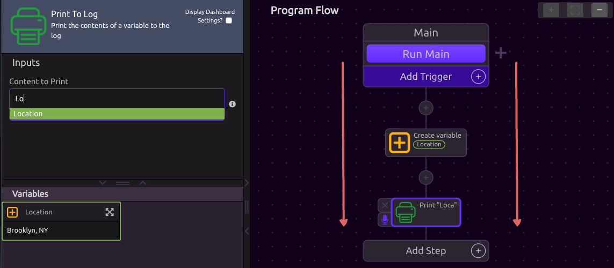
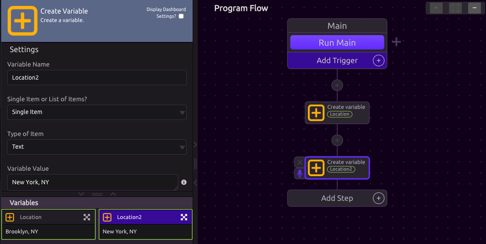
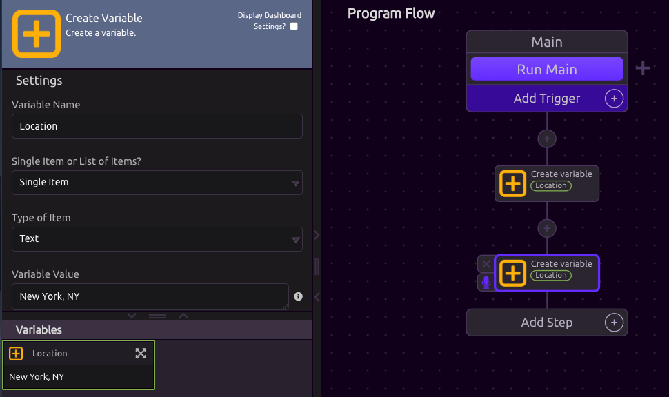

# Program Flow

## Program Run Order

When you build a WayScript program, your program executes in order. The easiest way to think of this is like stops on an assembly line. Each station on the assembly line can use anything built before, however, something needs to have been built before it can be used. Therefore, if I want to print a variable, that variable needs to have been created _before_ the print step. 

Therefore, if you were to switch the order of these two steps - than the Location variable would not be accessible in the Print to Log step because it has not been created yet. 

## Variable Values

Like other programming languages - **the names of variables matter**. Therefore, if you create a second variable with the same name, the value of the variable is overwritten. 

#### Different Variable Names

In this case, a new variable has been created called "Location2". Therefore, the Location variable assigned to "Brooklyn, NY" still exists. 

#### Overwrite Variable

In this case, the Location value of "Brooklyn, NY" has been overwritten because the new variable step has the same name of "Location"

