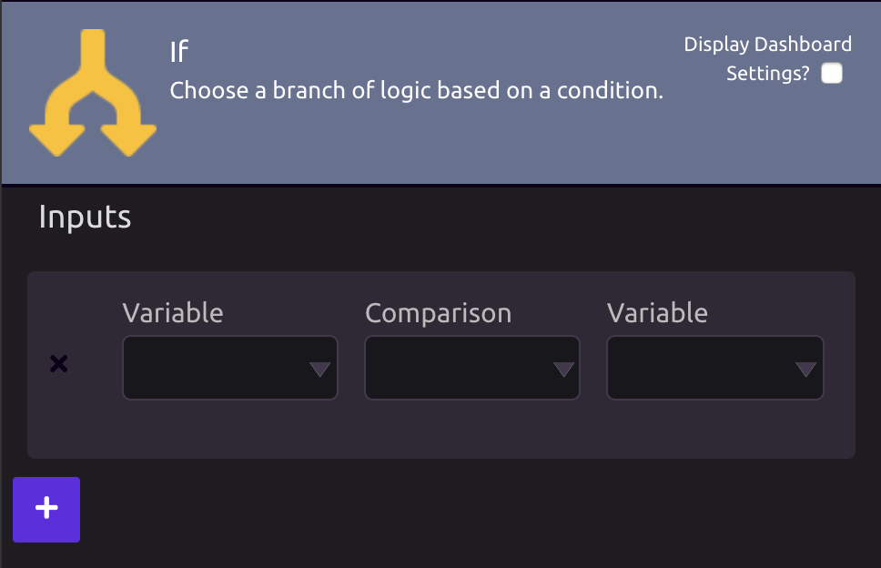
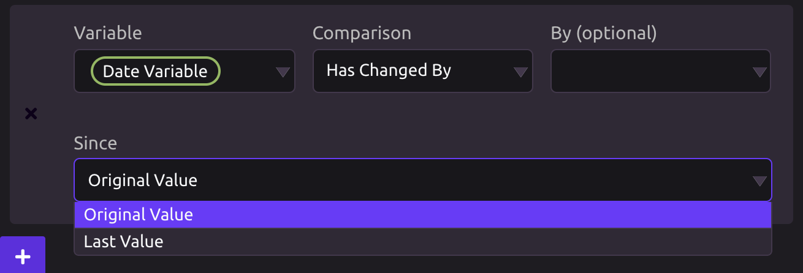
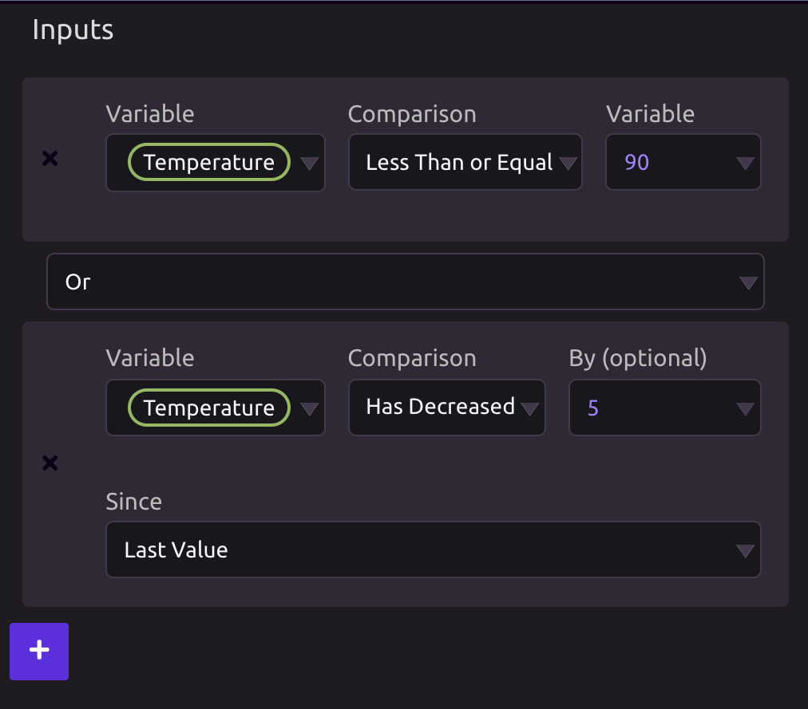
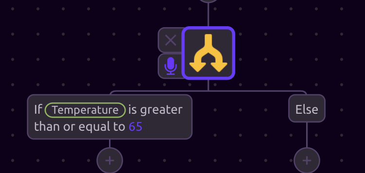

# Conditionals


For an overview on conditionals in WayScript, refer to the [Introduction to Conditionals](../../getting_started/conditionals.md).


## ⁉Condition Block

You will use this block to define a logic expression.

To create a logic expression, you will typically define values for the two Variable fields and then select how you want to compare them using the Comparison field.


Some comparisons, such as "Has Increased," "Has Decreased," "Has a Value," or "Does Not Have a Value," do not require a second variable input.


## 🔎Comparison Field

After defining a value for the first Variable, you can select an option for the Comparison field. 


You will not be able to select a value for the Comparison field until a value for the first Variable has been defined.


### 🔢Number Comparison Options

* Is The Same As
* Is Not The Same As
* Is Greater Than
* Is Greater Than or Equal To
* Is Less Than
* Is Less Than or Equal To
* Has Changed By
* Has Not Changed By
* Has Increased By
* Has Decreased By
* Has a Value
* Does Not Have a Value

### 🔤Text and List Comparison Options

* Is The Same As
* Is Not The Same As
* Contains
* Is Contained In
* Is Not Contained In
* Shares any Items With
* Has Any Items
* Has Changed
* Has Not Changed
* Has a Value
* Does Not Have a Value

### 📆Date Comparison Options

* Is The Same As
* Is Before
* Is After
* Has Changed By
* Has Not Changed By
* Has a Value
* Does Not Have a Value

### 🔠Case Sensitive Comparison

For non-Number fields, you will have the option to compare in a Case Sensitive manner. \(Default comparison is Case Insensitive.\)

 

### 📈"Changed By" Comparisons

For "Changed By," "Increased/Decreased By," and similar comparisons, you can optionally choose the amount by which you want to check the value has changed. You can also choose whether to compare to the Original Value of the variable, or the Last \(most recent\) Value.

## ➕**Adding Multiple Conditions**

By pressing the **+** button in the Inputs section, you can add additional conditions.

### 💡Logical Operators

* **And:** Use if you want your expression to evaluate to `True` only when _**both**_ conditions are `True`.
* **Or:** Use if you want your expression to evaluate to `True` when _**at least one**_ of your conditions are `True`.

## \*\*\*\***If / Else**

The **If** branch will run if your logic expression evaluates to `True`.

The **Else** branch will run if your logic expression evaluates to `False`.

## 🌡**Example**

In the below example, if the value of the variable "Temperature" is between 65 and 90, then the program will print _"It's a nice day!"_. 

Else, if the "Temperature" variable is outside of this range, then the program will print _"It's too cold!"_.

The program will then continue to run the rest of the modules following the If / Else statement.

## 

