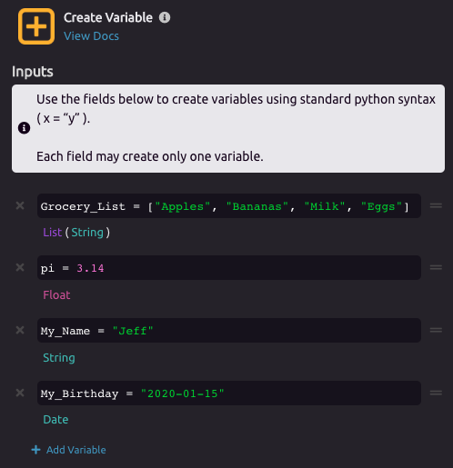

# Create Variable


For a tutorial on creating variables in WayScript, see [Getting Started - Variables](../../getting_started/variables.md).


## 🔤 **Creating a Variable**

Creating variables in WayScript is done using [standard Python syntax](https://www.learnpython.org/en/Variables_and_Types). You can create as many variables as you like using a single Create Variable module by adding a new field to create each additional variable.

