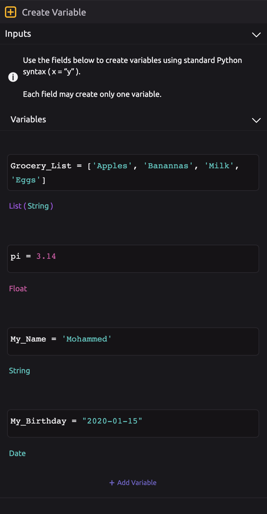
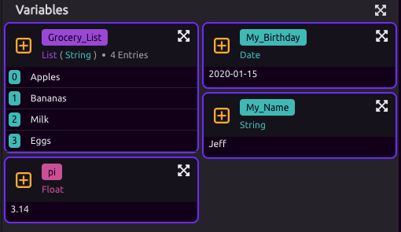
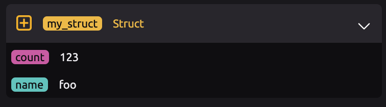
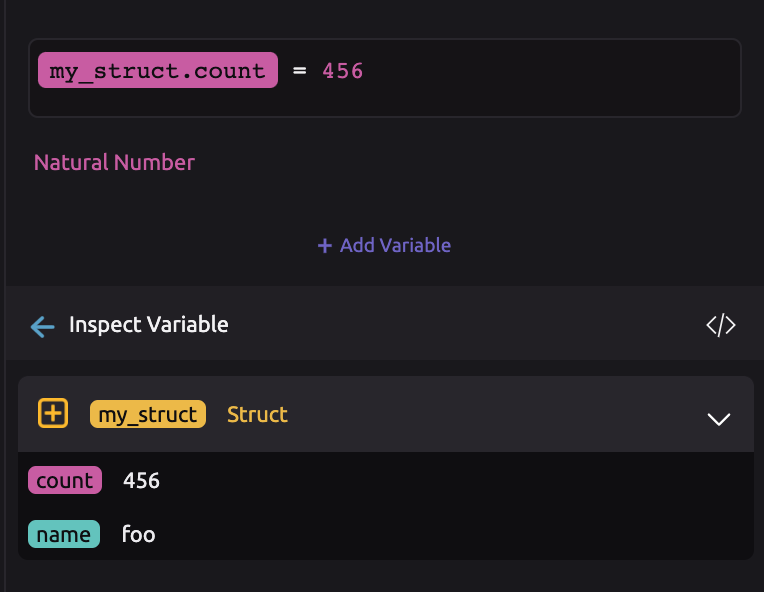

# Create Variable


For a tutorial on creating variables in WayScript, see [Getting Started - Variables](../../getting_started/variables.md).


## \*\*\*\*🔤 **Creating a Variable**

Creating variables in WayScript is done using [standard Python syntax](https://www.learnpython.org/en/Variables_and_Types). You can create as many variables as you like using a single Create Variable module by adding a new field to create each additional variable.

## ✏ Updating the Value of a Variable

You can also use the Create Variable module to edit the value of a variable. To do this, drag the variable pill into the Create Variable module and assign the new value to the pill.

For example, suppose you created the variable "my\_struct" previously in your program, but you want to change "my\_struct.count" from 123 to 456.

Simply drag the "my\_struct.count" pill into a new Create Variable step and assign it the new value.

