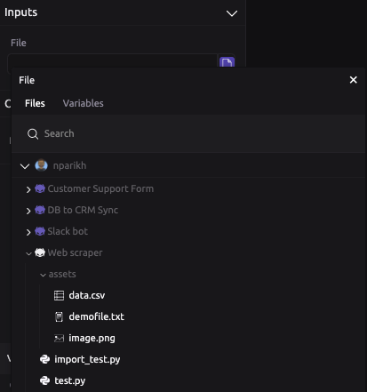

# File Actions

## 🔍 Read File

Read in a file from the WayScript [File System](../../getting_started/file-system.md) to create a File Variable that can be used in other modules. For example, read in an HTML file to pass its contents into the [HTTP Response](../modules/http-response.md) module. 

### Inputs

Select file or variable from the WayScript File System to be referenced by a new File Variable. 

### Outputs

Toggle whether the File Actions module generates a File Variable with the following attributes:

* `bytes` - raw data associated with the file
* `extension` - file format
* `filename` - name of file as shown in the WayScript File System
* `filepath` - absolute path to file
* `mimetype` - nature and format of the file
* `url` - static url if file has been made public, otherwise NULL

## ⬇ Save a File

Convert raw data stored in a WayScript variable into a file saved on the WayScript File System. 

### Inputs

* `File Name` - what you would like the new file to be named, including the extension
* `File Bytes` - the variable data that should be added to the file
* `File Location` - where to store the file on the WayScript File System

### Advanced

You can toggle whether to allow overwriting of an existing file or generate an error when the file path matches that of an existing file. 

