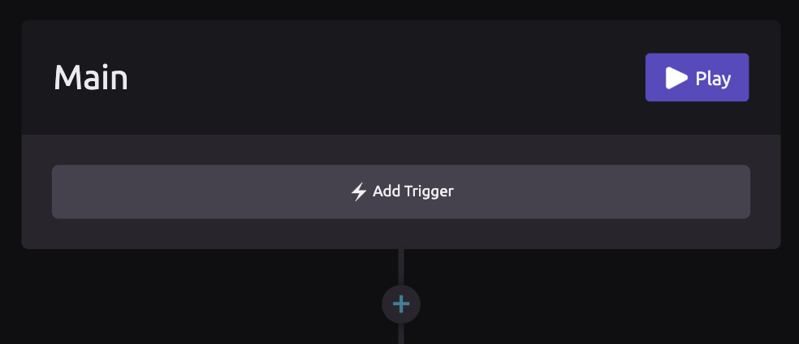
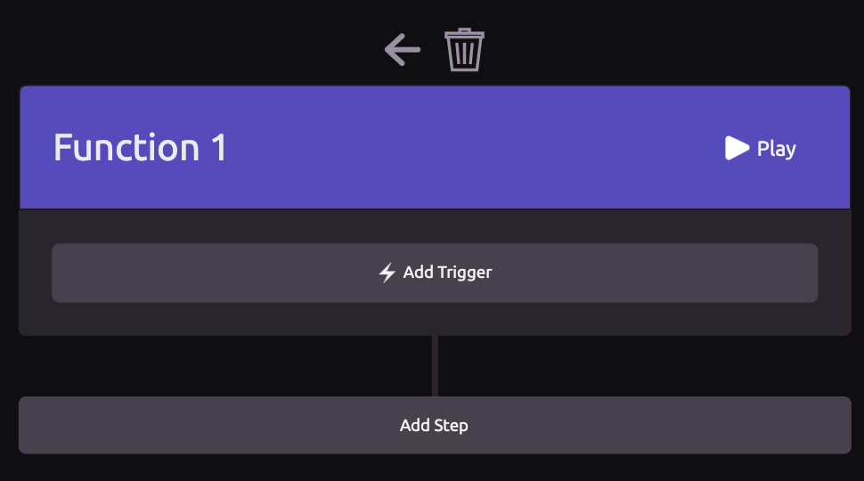

# Functions

## ▶ Main Function

When you first create a WayScript program, you will see one function, called "Main." By default, the Main function is the starting point for your WayScript program.


You cannot delete the Main function, but you can rename it, or [define inputs/outputs](function-definition.md).


## ➕ Creating a New Function

To create a new function, click the **+** icon to the right of the function header. A new function tree will appear to the right of the previous function.

### ❌ Deleting a Function

To delete a function, hover over the header and click the **x** icon to the left of the function name.

## 📖 Next Steps

Once you have created a function, you can:

* [Edit the function definition ](function-definition.md)\(change its name or define inputs and outputs\)
* [Call the function](function-call.md) from elsewhere in your WayScript program
* [Return values](return.md) from the function

