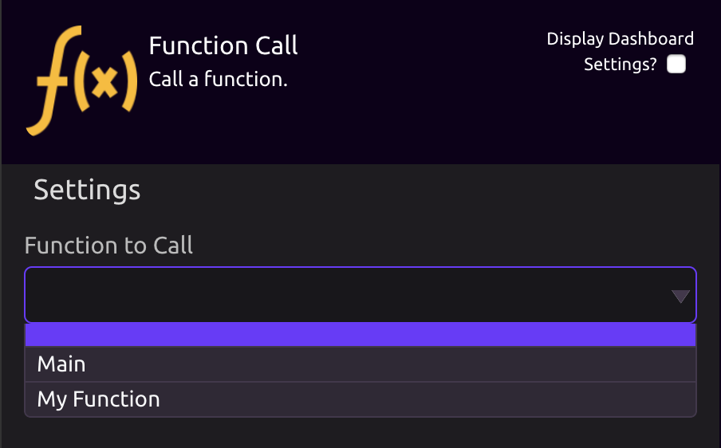
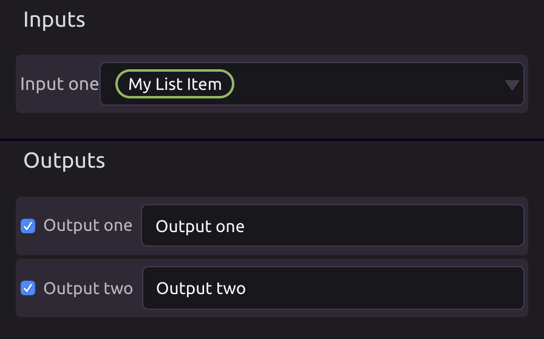

# Function Call

## 🔎**Select a Function to Call**

The function dropdown will contain the available functions to call in your program.

## ⚙**Choose your Inputs and Outputs**

Once you select a function to call, the inputs and outputs for that function will populate in the settings panel. Select your inputs and outputs as you would for any module.

