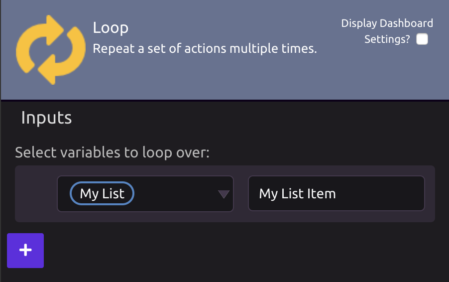
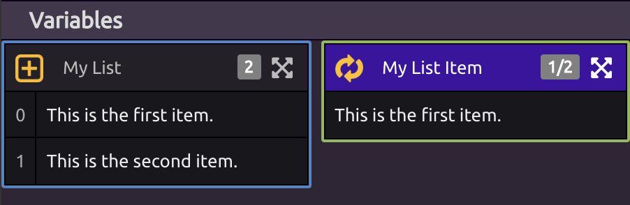
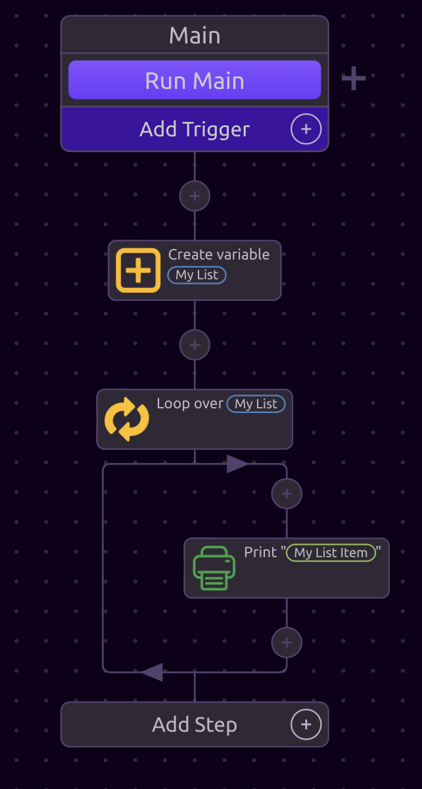
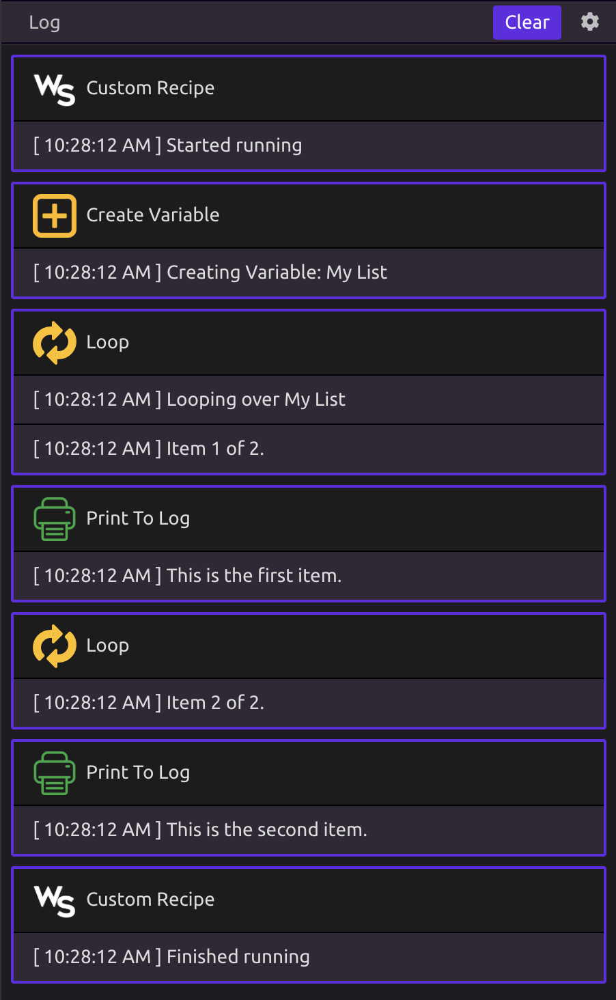

# Loops


To learn about using loops in WayScript, see [Looping / Iteration](../../../getting_started/looping-iteration.md).


## 📥Input

Looping over a list will perform the same operations on each value in the list.

When you select a list variable to loop over, a new "Item" variable will automatically be created for you. This "Item" variable will be set to the current item in the list on each iteration of the loop.


You can select multiple variables to loop over in one Loop module.



You can only loop over a list, so only variables that are lists will appear as options. 


## 💡Advanced Options

### ☝Start at Index

Define what index of the list you want to start iterating at. 


Indexes in a list start at 0, so the first item in a list is at index 0.


### 🔂Maximum Number of Times to Loop

Define the maximum number of values you want to iterate over in your list.

## Example

In the example below, the Loop module will iterate over each value in the "My List" variable and print each value to the log using the [Print To Log ](../print-to-log.md)module.

   

## 📖Control Flow Statements

The following loop control flow statements are available:

* [Break](break.md)
* [Continue](continue.md)

