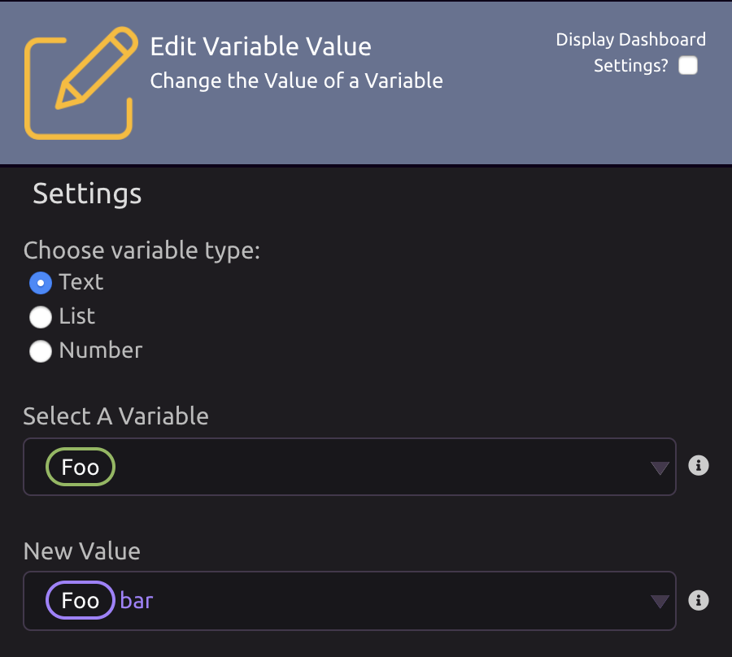

# Edit Variable Value

## Choose Variable Type

Select the type of value you want to store in the variable:

* Text
* List
* Number


You _can_ change the variable's type over the course of your program.


## Select A Variable

Choose the variable you want to update.

## New Value

Input a new value for your variable.


This can be a hardcoded value, the value of an existing variable, or a combination of the two, as in the example above.


