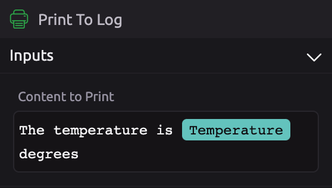
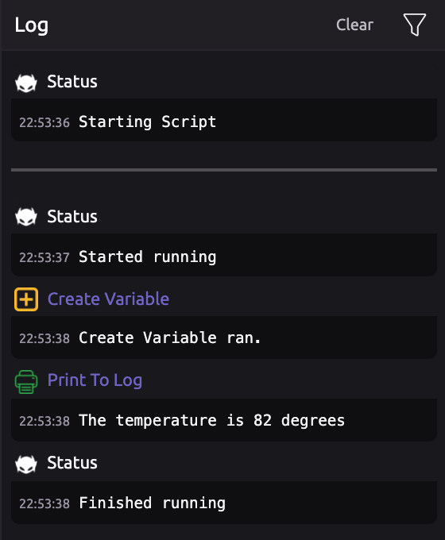

# Print To Log

## \*\*\*\*📥 **Inputs**

Enter text into the "Content to Print" field. The text entered will display in the log when the program runs.


You can include variable values by dragging them in from the Variables panel.


## 🔎 Log Filtering

You can filter the log to only show print statements by clicking the Gear Icon and disabling the types of steps you don't want to see.

