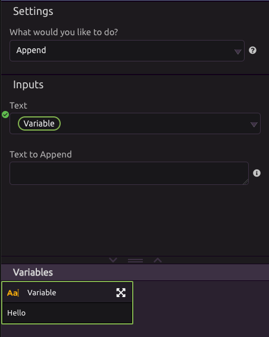
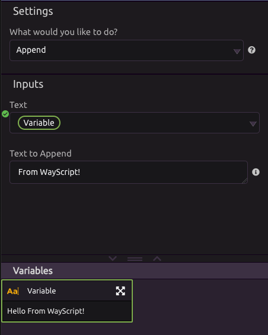

# Text Actions

## 📏 **Get Text Length**

Outputs the number of characters in your text.


White space counts as a character


## ➕ Append

### Inputs

This mode allows you to append a text value to another value. 

* Text 
* Text to Append

**Example:**

**Text** = 'Hello'

**Text to Append** = ' From WayScript'

After this, text will now have a value of 'Hello From WayScript'

## \#⃣ **Get Number of Times A Word Occurs**

Outputs the number of times the word you're looking for occurs in your text.

## 🔢 **Get Number of Words in Text**

Outputs the number of words in your text.

## ✂ **Get a Substring**

Outputs a new text variable containing the characters from the starting index up to the ending index of your text.

**Example:**  
Text = This is a sentence!  
Starting index = 5  
Ending index = 9  
Substring = is a


WayScript indexes are 0-based, meaning that the first character in a string has an index of 0.


## 🔡 **Make Text all Lowercase**

Outputs a copy of your text with all the characters converted to lowercase.

## 🔠 **Make Text all Uppercase**

Outputs a copy of your text with all the characters converted to uppercase.

## 📃 **Split Text Into a List**

Outputs a list of text objects after splitting your text up by the given "Split Text On" string.

**Example:**  
Text = This is a sentence!  
Split Text On = " " \(space\)  
Output list = \[ 'This', 'is', 'a', 'sentence!' \]

## 🔗 Join List Items Into Text

Concatenates the values of every item in your list by separating each list entry with the text you specify in "Join Text On," then outputs the result as a single text variable.

**Example:**  
List = \[ 'This', 'is', 'a', 'sentence!' \]  
Join Text On = " " \(space\)  
Output text = This is a sentence!

## ➕ **Combine Text**

Outputs a copy of your text with the given new text appended to it.

## 🔎 **Replace Text**

Finds all instances of the given string you're looking for in your text, and outputs a copy of your text in which all instances of the given string have been replaced with the specified replacement text.

## ⬆ **Capitalize First Letter in Every Word**

Outputs a copy of your text in which the first letter in all the words are converted to uppercase.

