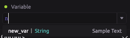
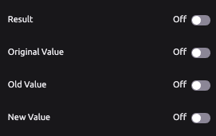
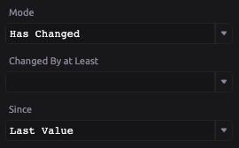

# Variable has Changed

  
The variable has changed module allows you to compare the values of a WayScript [variable](../../getting_started/variables.md) between script runs and output whether or not the value has changed. 

## ​​ 🔦 Select an input Variable 

Input a WayScript variable to be used for comparison between script runs. ‌

* **Variable** - this is the name of the variable you are inputting for the comparison. Start typing the variable name and you can select the right variable from the drop-down menu. ​

## 📤 Generate output Variables

You can generate 4 new variables as an output of the variable comparison

* `Result` - Generates a `True` or `False` boolean value based on the Mode set
* `Original Value` - Creates a new variable with the original value
* `Old Value` - Creates a new variable with the value from the previous script run
* `New Value` - Creates a new variable with the current value of the variable

## ‌ ⚙ Settings

* **Mode** 
  * `Has Changed` - Checks whether the variable's value is not the same as its comparison value
  * `Has Not Changed` - Checks whether the variable's value is the same as its comparison value
  * `Has Increased` - Checks whether the variable's value has increased versus its value from the previous script run
  * `Has Decreased` - Checks whether the variable's value has decreased versus its value from the previous script run
* **Changed By at Least**
  * For numeric variable types, you can set a threshold for which the module will ignore a change in value. 
  * For example, a threshold of 2 would make the `Has Changed` comparison between values 4 and 3 evaluate to `True`
* **Since**
  * `Last Value` - Compares current variable value to variable value from previous script run
  * `Original Value` - Compares current variable value to variable value set on first script run

