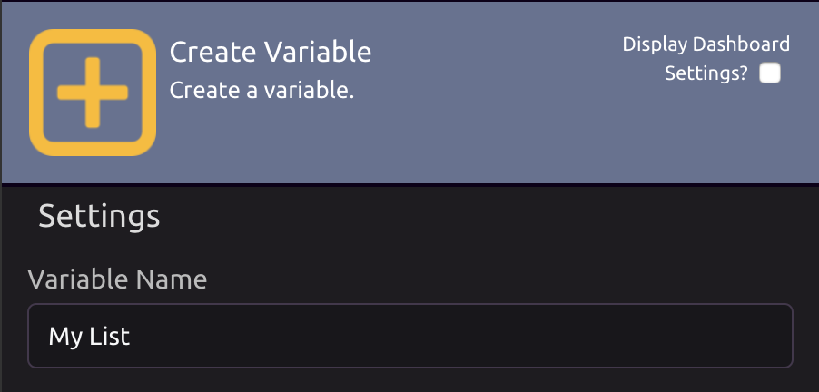
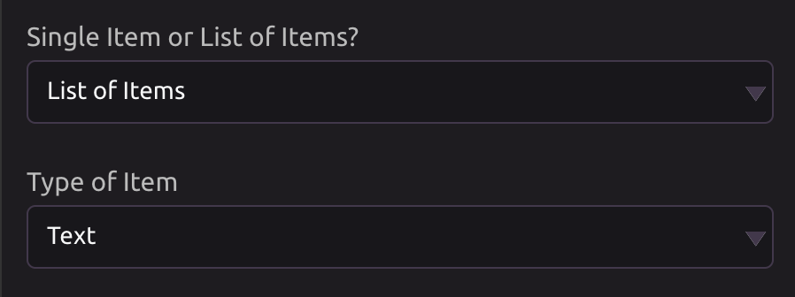
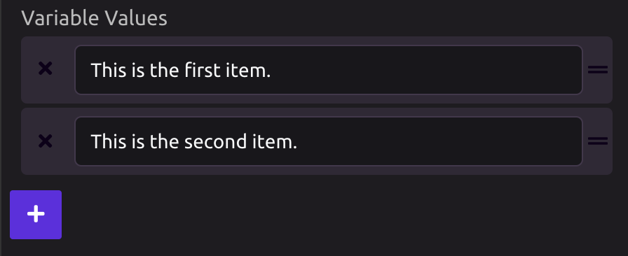

# Create Variable

## 🔤 **Variable Name**

Assign a name to your variable. This name will be used to reference the value of your variable throughout your program.

## ⚙**Define the Characteristics of Your Variable**

Define whether your variable will have a [single value](../../../getting_started/variables.md#single-item) or contain a [list of values](../../../getting_started/variables.md#lists).

Choose what [type of data](../../../getting_started/variables.md#variable-types) your variable will hold.

## ✏**Set the Value of Your Variable**

Type in the value for your variable.

If your variable is a list, press the **+** button to add more values to your list.

