# Alpha Vantage



Check out their [website](https://www.alphavantage.co/documentation/).


## 📈 Overview

[Alpha Vantage Inc.](https://www.alphavantage.co/#about) "is a leading provider of free APIs for realtime and historical data on stocks, forex \(FX\), and digital/crypto currencies."

The WayScript Alpha Vantage module gives you easy access to this information.

### 📖 Available Data

* [Most Recent Stock Data](alpha-vantage.md#most-recent-stock-data)
* [Time Series Data](alpha-vantage.md#time-series-data)
* [Digital/Crypto Currencies](alpha-vantage.md#digital-crypto-currencies)
* [Simple Moving Average \(SMA\)](alpha-vantage.md#simple-moving-average-sma)
* [Exponential Moving Average \(EMA\)](alpha-vantage.md#exponential-moving-average-ema)
* [Moving Average Convergence / Divergence \(MACD\)](alpha-vantage.md#moving-average-convergence-divergence-macd)
* [Stochastic Oscillator \(STOCH\)](alpha-vantage.md#stochastic-oscillator-stoch)
* [Relative Strength Index \(RSI\)](alpha-vantage.md#relative-strength-index-rsi)
* [Average Directional Movement Index \(ADX\)](alpha-vantage.md#average-directional-movement-index-adx)
* [Commodity Channel Index \(CCI\)](alpha-vantage.md#commodity-channel-index-cci)
* [Aroon \(AROON\)](alpha-vantage.md#aroon-aroon)
* [Bollinger Bands \(BBANDS\)](alpha-vantage.md#bollinger-bands-bbands)
* [Chaikin A/D Line \(AD\)](alpha-vantage.md#chaikin-a-d-line-ad)
* [On Balance Volume \(OBV\)](alpha-vantage.md#on-balance-volume-obv)
* [Sector Performances \(SECTOR\)](alpha-vantage.md#sector-performances-sector)

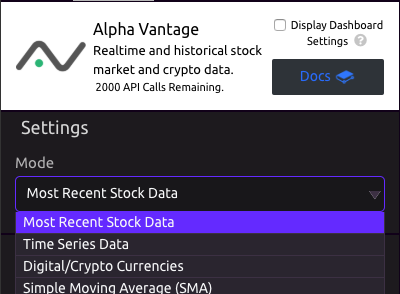

## Most Recent Stock Data

### 📥 Inputs

Enter the name of the equity of your choice.

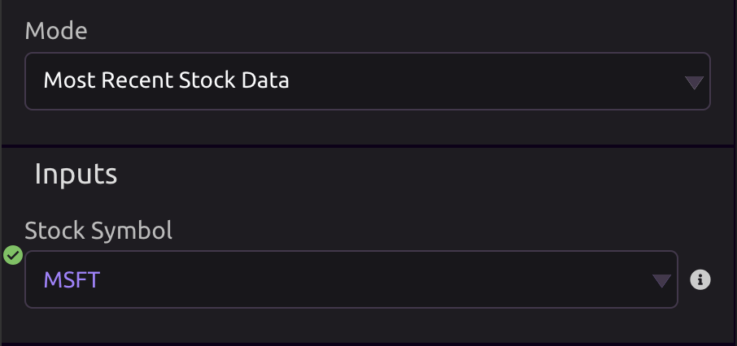

### 📤 Outputs

```text
Stock_Data = {
    open : Float,
    high : Float,
    low : Float,
    close : Float,
    volume : Float,
    ticker : String,
}
```

**JSON\_DATA** \(String\)

## Time Series Data

### ⚙ Settings

* Time Interval Between Data Points
* Time Period
* Output Size
  * Last 100 Data Points
  * All Data Points \(Returns the full-length time series of up to 20 years of historical data\)

### 📥 Inputs

Enter the name of the equity of your choice.

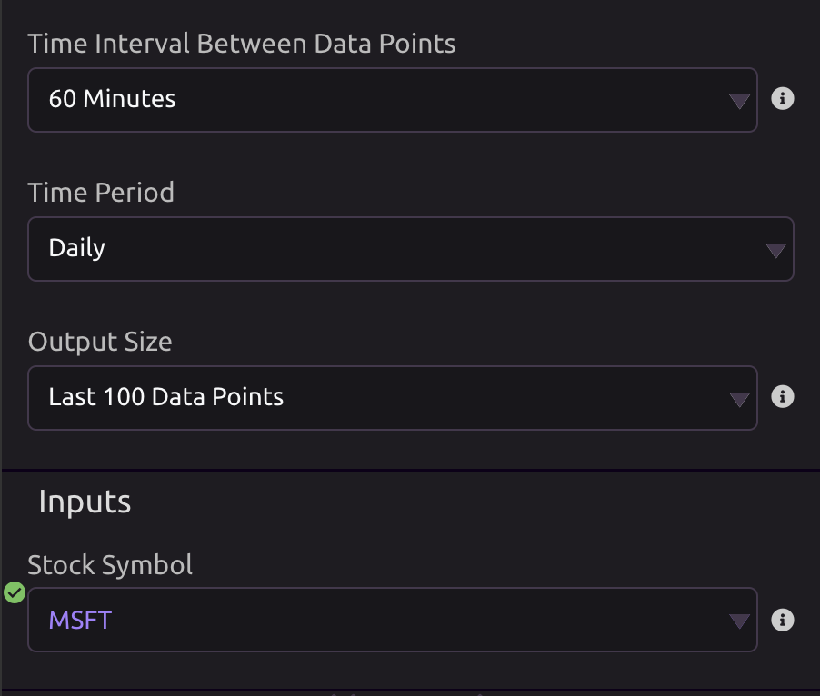

### 📤 Outputs

```text
Time_Series = { 
    meta = { 
        symbol : String,
        last_refreshed: String,
        output_size : String,
        timezone: String, 
    },
    data = [ 
       { 
           date : Date,
           open : Float,
           high : Float,
           low : Float,
           close : Float,
           volume : Float,
       },
    ]
}

```

**JSON\_Data** \(String\)

## Digital/Crypto Currencies

### ⚙ Settings

* Digital Currency
* Exchange Market
* Time Period

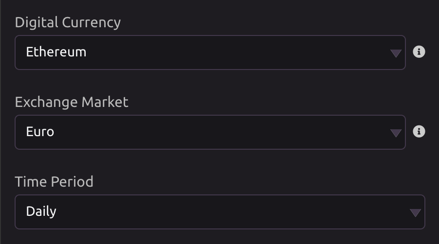

### 📤 Outputs

```text
Crypto_Data = {
    meta : {
        digital_currency_code : String,
        digital_currency_name : String,
        market_code : String,
        market_name : String,
        last_refreshed : Date,
        timezone : String,
    },
    data : [
        {
          date : Date,
          open_usd : Float,
          open_cny : Float,
          high_usd : Float,
          high_cny : Float,
          low_usd : Float,
          low_cny : Float,
          close_usd : Float,
          close_cny : Float,
          volume : Float,
          mkt_cap_usd : Float,  
        },
    ]
}
```

**JSON\_DATA** \(String\)

## Simple Moving Average \(SMA\)

### ⚙ **Settings**

* **Time Interval Between Data Points -** Time interval between two consecutive data points in the time series.
* **Time Series Period** - Number of data points used to calculate each SMA value. Positive integers are accepted. \(e.g. Time Period = 60, Time Period = 200\)
* **Series Type** - The desired price type in the time series. Four types are supported: Close, Open, High, Low.

### 📥 **Inputs**

Enter the name of the equity of your choice.

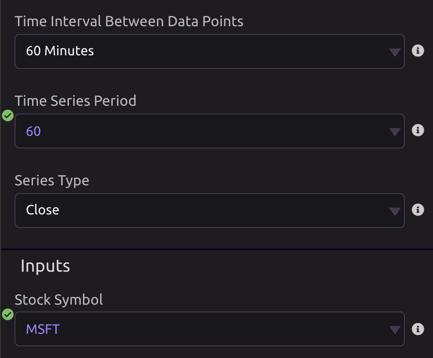

### 📤 **Outputs**

* Date
* SMA
* JSON Data

## Exponential Moving Average \(EMA\)

### ⚙ **Settings**

* **Time Interval Between Data Points -** Time interval between two consecutive data points in the time series.
* **Time Series Period** - Number of data points used to calculate each EMA value. Positive integers are accepted. \(e.g. Time Period = 60, Time Period = 200\)
* **Series Type** - The desired price type in the time series. Four types are supported: Close, Open, High, Low.

### 📥 **Inputs**

Enter the name of the equity of your choice.


### 📤 **Outputs**

* Date
* EMA
* JSON Data

## Moving Average Convergence / Divergence \(MACD\)

For more information, see [How to use moving-average convergence divergence \(MACD\)](https://blog.liquid.com/cryptocurrency-technical-analysis-moving-average-convergence-divergence-macd).

### ⚙ **Settings**

* **Time Interval Between Data Points -** Time interval between two consecutive data points in the time series.
* **Series Type** - The desired price type in the time series. Four types are supported: Close, Open, High, Low.

### 💡 Advanced Settings

* **Fast Period** - Defaults to 12.
* **Slow Period** - Defaults to 26.
* **Signal Period** - Defaults to 9.


### 📥 **Inputs**

Enter the name of the equity of your choice.

### 📤 Outputs

* Date
* MACD
* MACD Signal
* MACD Histogram
* JSON Data

## Stochastic Oscillator \(STOCH\)

For more information, see [Stochastic oscillator](https://en.wikipedia.org/wiki/Stochastic_oscillator).

### ⚙ **Settings**

* **Time Interval Between Data Points -** Time interval between two consecutive data points in the time series.

### 💡 Advanced Settings

* **Fast K Period** - Defaults to 5.
* **Slow K Period** - Defaults to 3.
* **Slow D Period** - Defaults to 3.
* **Slow K Moving Average Type**
  * Simple Moving Average \(SMA\)
  * Exponential Moving Average \(EMA\)
  * Weighted Moving Average \(WMA\)
  * Double Exponential Moving Average \(DEMA\)
  * Triple Exponential Moving Average \(TEMA\)
  * Triangular Moving Average \(TRIMA\)
  * T3 Moving Average
  * Kaufman Adaptive Moving Average \(KAMA\)
  * MESA Adaptive Moving Average \(MAMA\)
* **Slow D Moving Average Type**
  * Simple Moving Average \(SMA\)
  * Exponential Moving Average \(EMA\)
  * Weighted Moving Average \(WMA\)
  * Double Exponential Moving Average \(DEMA\)
  * Triple Exponential Moving Average \(TEMA\)
  * Triangular Moving Average \(TRIMA\)
  * T3 Moving Average
  * Kaufman Adaptive Moving Average \(KAMA\)
  * MESA Adaptive Moving Average \(MAMA\)

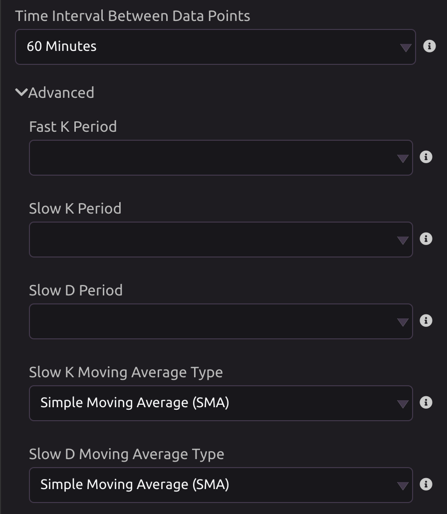

### 📥 **Inputs**

Enter the name of the equity of your choice.

### 📤 Outputs

* Date
* Slow K
* Slow D
* JSON Data

## Relative Strength Index \(RSI\)

### ⚙ **Settings**

* **Time Interval Between Data Points -** Time interval between two consecutive data points in the time series.
* **Time Series Period** - Number of data points used to calculate each RSI value. Positive integers are accepted. \(e.g. Time Period = 60, Time Period = 200\)
* **Series Type** - The desired price type in the time series. Four types are supported: Close, Open, High, Low.
* **Data to Return**
  * Most Recent \(Only the latest RSI\)
  * All

### 📥 **Inputs**

Enter the name of the equity of your choice.

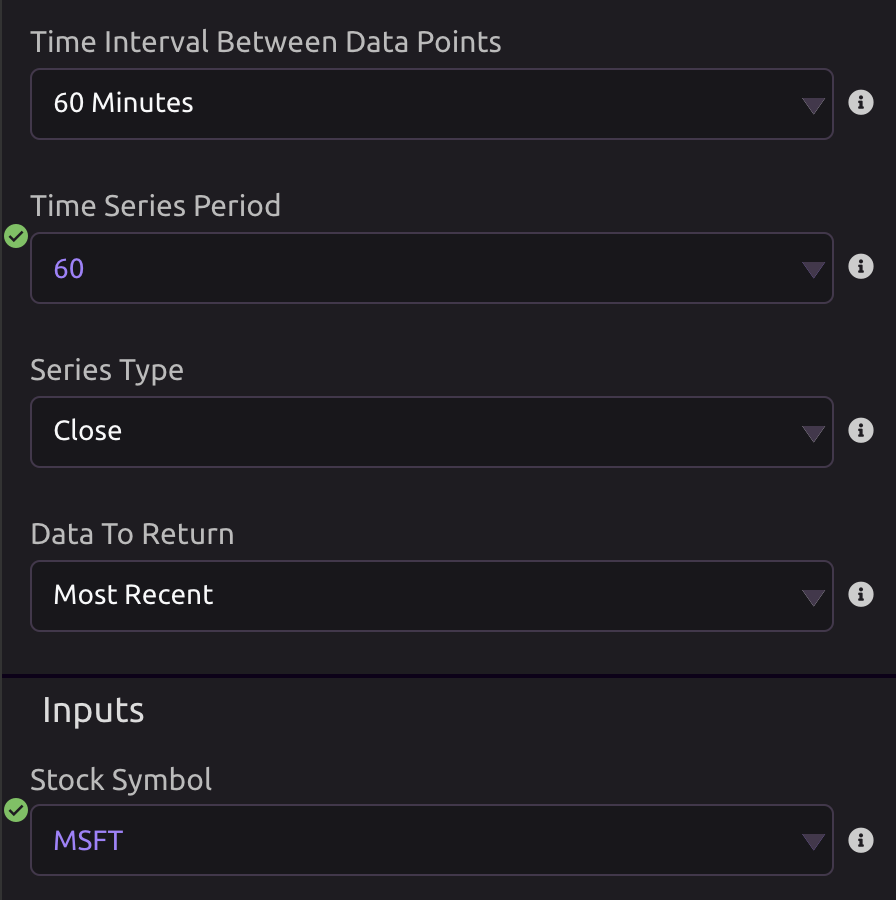

### 📤 Outputs

* Date
* RSI
* JSON Data

## Average Directional Movement Index \(ADX\)

### ⚙ **Settings**

* **Time Interval Between Data Points -** Time interval between two consecutive data points in the time series.
* **Time Series Period** - Number of data points used to calculate each ADX value. Positive integers are accepted. \(e.g. Time Period = 60, Time Period = 200\)

### 📥 **Inputs**

Enter the name of the equity of your choice.

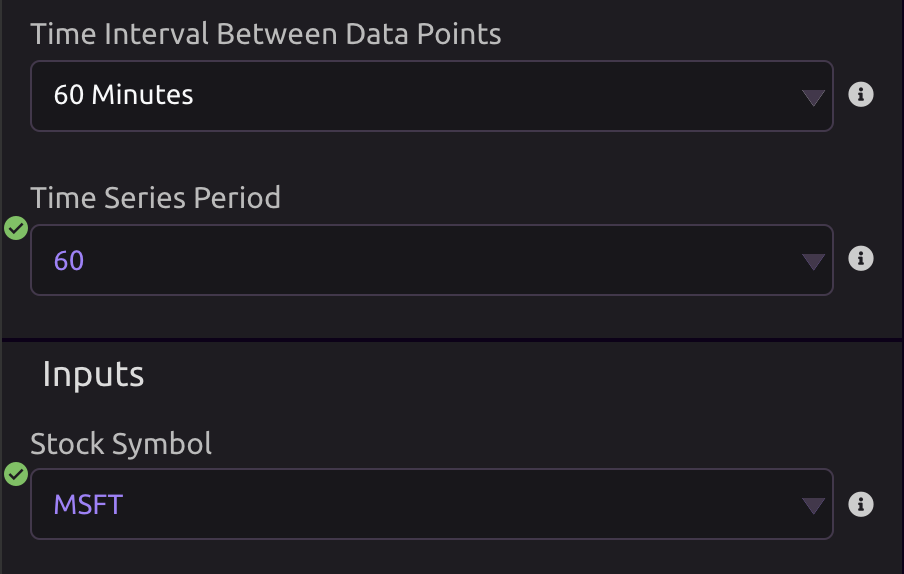

### 📤 Outputs

* Date
* ADX
* JSON Data

## Commodity Channel Index \(CCI\)

### ⚙ **Settings**

* **Time Interval Between Data Points -** Time interval between two consecutive data points in the time series.
* **Time Series Period** - Number of data points used to calculate each CCI value. Positive integers are accepted. \(e.g. Time Period = 60, Time Period = 200\)

### 📥 **Inputs**

Enter the name of the equity of your choice.


### 📤 Outputs

* Date
* CCI
* JSON Data

## Aroon \(AROON\)

For more information, see [Aroon](https://school.stockcharts.com/doku.php?id=technical_indicators:aroon).

### ⚙ **Settings**

* **Time Interval Between Data Points -** Time interval between two consecutive data points in the time series.
* **Time Series Period** - Number of data points used to calculate each Aroon value. Positive integers are accepted. \(e.g. Time Period = 60, Time Period = 200\)

### 📥 **Inputs**

Enter the name of the equity of your choice.


### 📤 Outputs

* Date
* Aroon Down
* Aroon Up
* JSON Data

## Bollinger Bands \(BBANDS\)

For more information, see [Bollinger Bands](https://www.bollingerbands.com/bollinger-bands).

### ⚙ **Settings**

* **Time Interval Between Data Points -** Time interval between two consecutive data points in the time series.
* **Time Series Period** - Number of data points used to calculate each band value. Positive integers are accepted. \(e.g. Time Period = 60, Time Period = 200\)
* **Series Type** - The desired price type in the time series. Four types are supported: Close, Open, High, Low.

### 💡 Advanced Settings

* **Number Deviation Up** - The standard deviation multiplier of the upper bound. Defaults to 2.
* **Number Deviation Down** - The standard deviation multiplier of the lower bound. Defaults to 2.
* **Moving Average Type**
  * Simple Moving Average \(SMA\)
  * Exponential Moving Average \(EMA\)
  * Weighted Moving Average \(WMA\)
  * Double Exponential Moving Average \(DEMA\)
  * Triple Exponential Moving Average \(TEMA\)
  * Triangular Moving Average \(TRIMA\)
  * T3 Moving Average
  * Kaufman Adaptive Moving Average \(KAMA\)
  * MESA Adaptive Moving Average \(MAMA\)

### 📥 **Inputs**

Enter the name of the equity of your choice.

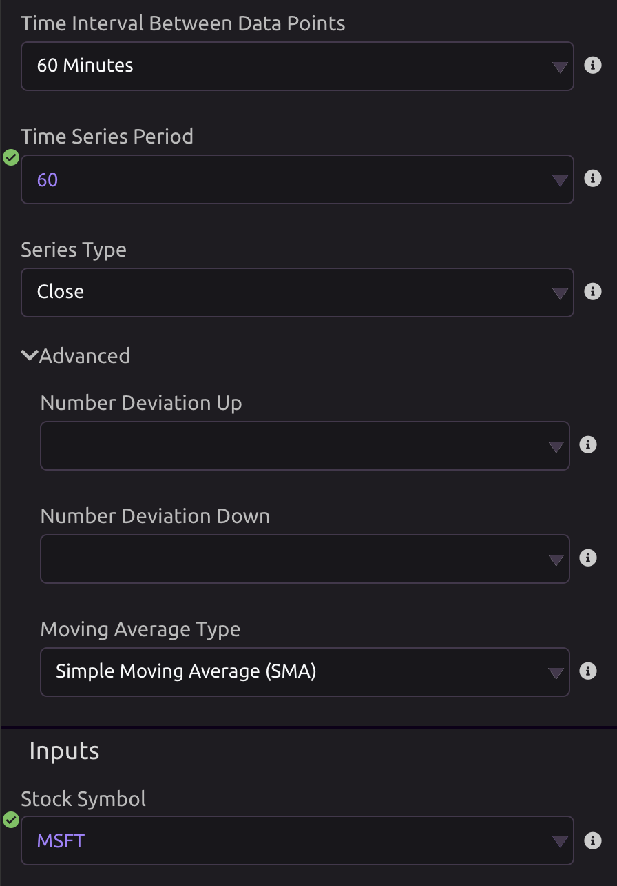

### 📤 Outputs

* Date
* Real Middle Band
* Real Lower Band
* Real Upper Band
* JSON Data

## Chaikin A/D Line \(AD\)

### ⚙ **Settings**

* **Time Interval Between Data Points -** Time interval between two consecutive data points in the time series.

### 📥 **Inputs**

Enter the name of the equity of your choice.

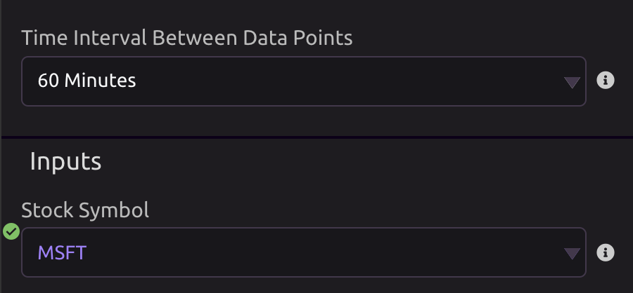

### 📤 Outputs

* Date
* Chaikin A/D
* JSON Data

## On Balance Volume \(OBV\)

### ⚙ **Settings**

* **Time Interval Between Data Points -** Time interval between two consecutive data points in the time series.

### 📥 **Inputs**

Enter the name of the equity of your choice.


### 📤 Outputs

* Date
* OBV
* JSON Data

## Sector Performances \(SECTOR\)

Outputs performance data for various market sectors.

### 🗓 Timeframe

The timeframe output gives the labels for each sector's data points.

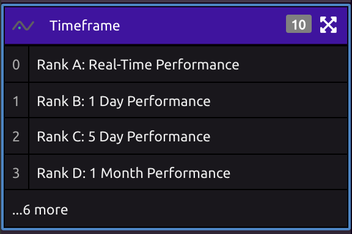

### 🏦 Sectors

* Utilities
* Consumer Staples
* Information Technology
* Real Estate
* Consumer Discretionary
* Industrials
* Materials
* Financials
* Communication Services
* Health Care
* Energy

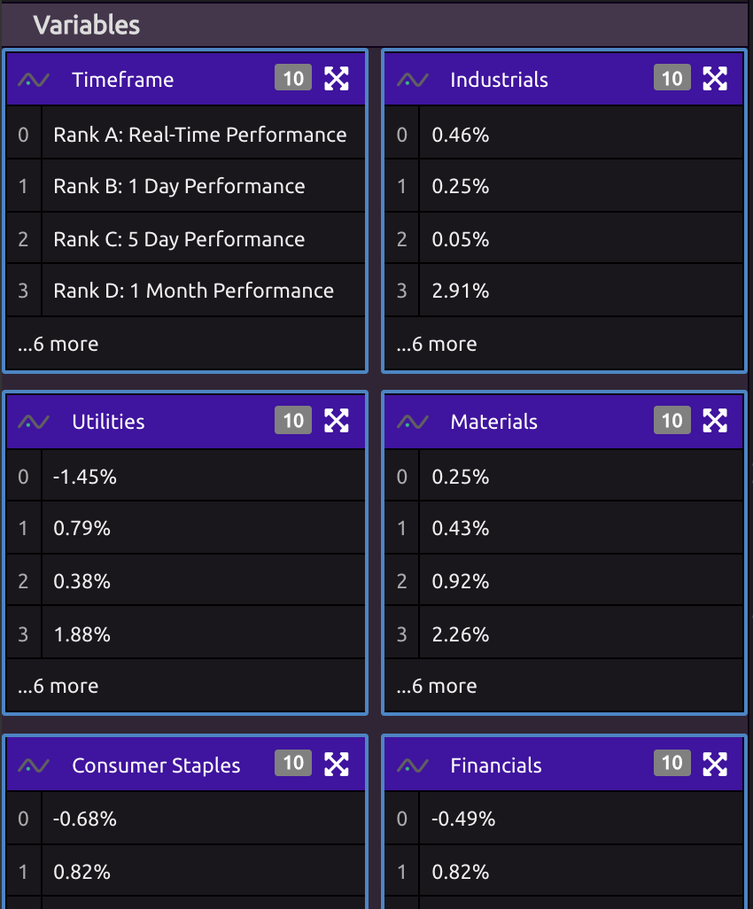

### 📤 Other Outputs

* JSON Data

