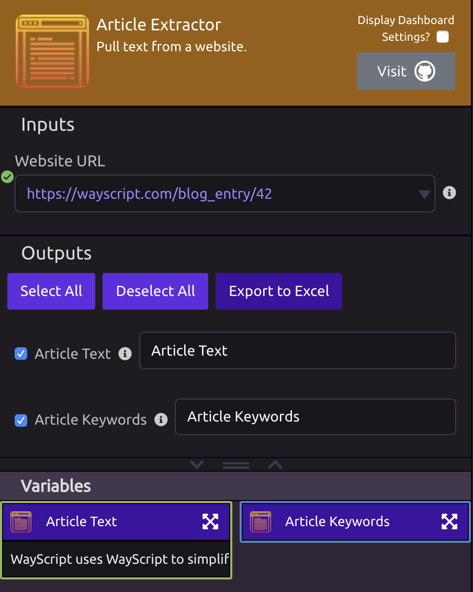

# Article Extractor


Check out goose3 on [GitHub](https://github.com/goose3/goose3).


## 📥 Inputs

* **Website URL** - Enter the URL of the article you want to pull.

## 📤 Outputs

* **Article Text** - Contains all of the text from the article.
* **Article Keywords** - Contains a list of keywords that were found in the article.

