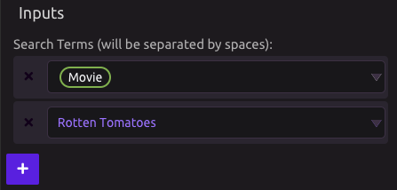
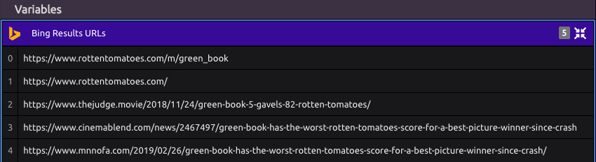

# Bing

## 🔎Search Term

You can build a search phrase using one or multiple components, each having any combination of text and variable input.

For example, suppose I have a list variable containing movie titles, and I want to search for the 'Rotten Tomatoes' page for each movie.

## 📤Outputs

* Bing Result URLs: A list of URLs from the top 5 search results.
* JSON Data: The raw data return from Bing.

