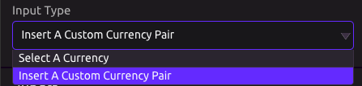
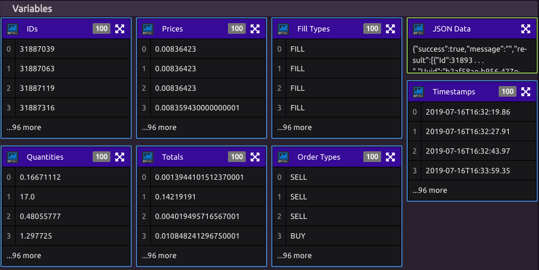

# Bittrex

## Input

Certain modes collect data about the overall market, while others look up individual Tickers.


Tickers follow format 'Ticker 1-Ticker 2' where 1 unit of Ticker 2 is converted to Ticker 1.

Ex. Last Price for 'BTC-LTC' of 0.00832 means that 1 LTC = 0.00832 BTC.


For ticker queries, you can select an option from the available list, or input your own.

## Modes

The Following modes are available and the listed outputs can be retrieved as variables.


_\(Single\)_: variables are single items

_\(List\)_: variables are lists

_Note: '_JSON Data' is available for all modes and is always a single item.


### List of All Tickers _\(List\)_

* All Ticker Symbols: List of all Digital Currency pairs in the market

### Current Data for a Ticker _\(Single\)_

* Bid Price
* Ask Price
* Last Price

### Last 24 Hour Summaries of all Active Exchanges _\(List\)_

* Market Names
* High Prices
* Low Prices
* Volumes
* Last Prices
* Base Volumes
* Timestamps
* Bid Prices
* Ask Prices
* Number of Open Buy Orders
* Number of Open Sell Orders
* Previous Days

### Last 24 Hour Summary of a Ticker _\(Single\)_

* Bid Price
* Ask Price
* Last Price
* Market Name
* High Price
* Low Price
* Volume
* Base Volume
* Timestamp
* Open Buy Orders
* Open Sell Orders
* Previous Day

### Historical Market Data for a Ticker _\(List\)_

* Timestamps
* IDs
* Quantities
* Prices
* Totals
* Fill Types
* Order Types

