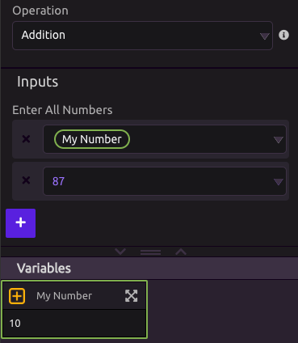
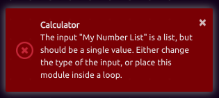

# Calculator

## 🔢 Input

Input fields accept manually entered numbers or single number variables.

Lists and combined inputs are not accepted.

## Operations

Select from The following list of operations.

* Addition
* Subtraction
* Multiplication
* Division
* Average
* Percent Change
* Generate a Random Number

## ➕ Addition

### 📥 Inputs

* Numbers to Add

### 📤 Outputs

* Result

## ➖ Subtraction

### 📥 Inputs

* Starting Value
* Numbers to subtract

### 📤 Outputs

* Result

## ✖Multiplication

### 📥 Inputs

* Numbers to multiply

### 📤 Outputs

* Result

## ➗ Division

### 📥 Inputs

* Numerator
* Divisor

### 📤 Outputs

* Result

## 📊 Average

### 📥 Inputs

* Numbers to average

### 📤 Outputs

* Result

## 📈 Percent Change

### 📥 Inputs

* Old Value
* New Value

### 📤 Outputs

* Decimal Result \(Same as dividing Old Value by New Value \)
* Percent Result \(Decimal Result \* 100%\)

## ❔ Generate a Random Number

Generate a random number from the [Discrete Uniform Distribution](https://en.wikipedia.org/wiki/Discrete_uniform_distribution) _U{Min, Max}_ where Min and Max are integer-valued.

### 📥 Inputs

* Minimum Value
* Maximum Value

### 📤 Outputs

* Result

