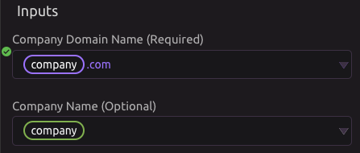

# Clearbit

## 🗝 Authorization

Clearbit is available to users who have their own API key.

If not authorized, you will be prompted to enter your API Key when you add the Clearbit Module to your program. You can edit your key later if it changes.

## 📥 Inputs

All Inputs accept manual, variable, or combined inputs.


Optional Inputs will can help improve the accuracy of your search


## 🏢 Lookup Company

### 📥 Inputs

* Company Domain Name _\(Required\)_
* Company Name _\(Optional\)_
* LinkedIn URL _\(Optional\)_
* Twitter Handle _\(Optional\)_
* Facebook URL _\(Optional\)_

### 📤 Outputs

* Company Name
* Company Legal Name
* Industry
* Sector
* SIC Code
* NAICS Code
* Company Technologies
* Company Tags
* Company Type
* Company Description
* Year Founded
* Company EIN
* Company Location
* Number of Employees
* Fiscal Year End
* Company Annual Revenue
* Alexa US Rank
* Alexa Global Rank
* Company Phone Number
* Company Facebook URL
* Company Twitter URL
* Company LinkedIn URL
* Company Crunchbase URL
* JSON Data

## 👤 Lookup Person

### 📥 Inputs

* Email Address _\(Required\)_
* First Name _\(Optional\)_
* Last Name _\(Optional\)_
* Location _\(Optional\)_
* Person's Employer _\(Optional\)_
* Person's Company Domain Name _\(Optional\)_
* LinkedIn URL _\(Optional\)_
* Twitter Handle _\(Optional\)_
* Facebook URL _\(Optional\)_

### 📤 Outputs

* Full Name
* Person's Email
* Person's Bio
* Person's Website
* Person's Location
* Employer
* Employer Website
* Job Title
* Job Role
* Employment Seniority
* Person's Facebook URL
* Person's Twitter URL
* Person's LinkedIn URL
* Person's Github URL
* JSON Data

## 🕵♀ Lookup Combined

### 📥 Inputs

* Email Address _\(Required\)_
* First Name _\(Optional\)_
* Last Name _\(Optional\)_
* Location _\(Optional\)_
* Person's Employer _\(Optional\)_
* Person's Company Domain Name _\(Optional\)_
* LinkedIn URL _\(Optional\)_
* Twitte Handle _\(Optional\)_
* Facebook URL _\(Optional\)_

### 📤 Outputs

* Full Name
* Person's Email
* Person's Bio
* Person's Website
* Person's Location
* Employer
* Employer Website
* Job Title
* Job Role
* Employment Seniority
* Person's Facebook URL
* Person's Twitter URL
* Person's LinkedIn URL
* Person's Github URL
* Company Name
* Company Legal Name
* Industry
* Sector
* SIC Code
* NAICS Code
* Company Technologies
* Company Tags
* Company Type
* Company Description
* Year Founded
* Company EIN
* Company Location
* Number of Employees
* Fiscal Year End
* Company Annual Revenue
* Alexa US Rank
* Alexa Global Rank
* Company Phone Number
* Company Facebook URL
* Company Twitter URL
* Company LinkedIn URL
* JSON Data

