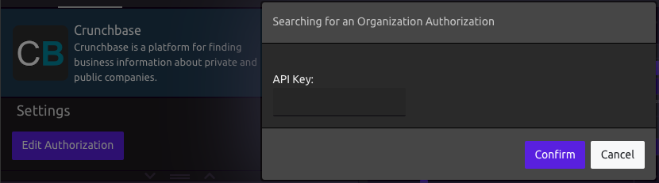

# Crunchbase


Check out the Crunchbase [website](https://data.crunchbase.com/reference).


## 🗝 Authorization

Crunchbase is available to users who have their own API key.

If not authorized, you will be prompted to enter your API Key when you add the Crunchbase Module to your program. You can edit your key later if it changes.

## 📥 Inputs

* Organization Name or Website
* Pull Investment Data if Org is an Investor

## 📤 Outputs

* Organization Name
* Short Description
* Description
* Min Number of Employees
* Max Number of Employees
* Total Funding USD
* Founder Names
* Founder Bios
* Current Team Names
* Current Team Job Titles
* Investment Company Names
* Investment Company Name for CB Search
* Investment Company URLs
* Investment Amount \(USD\)

