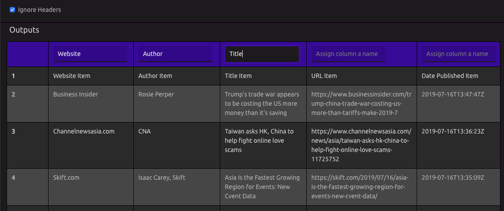
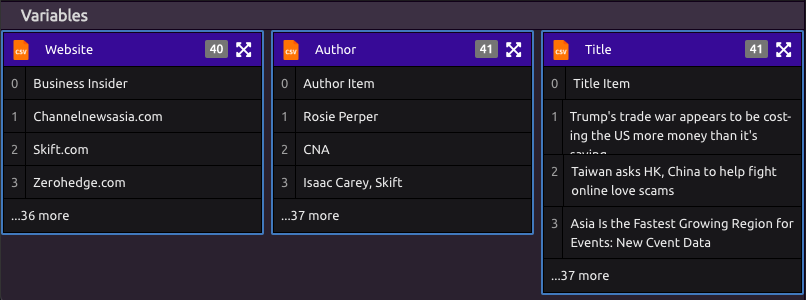
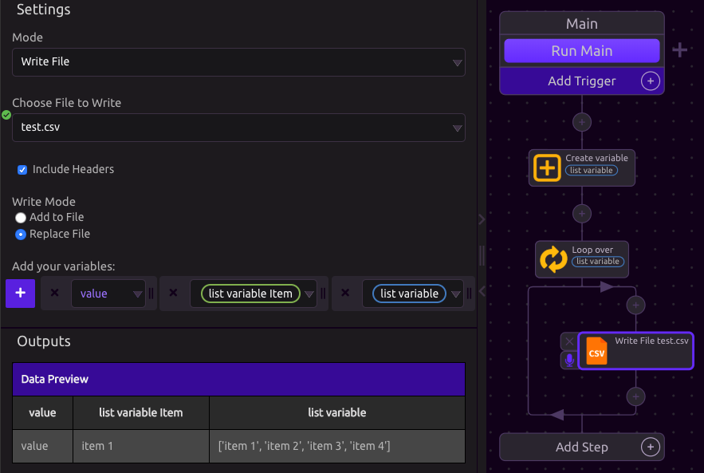

# CSV

## 📖Read File

Import columns from a CSV as WayScript variables.

### 📂 Select or Upload CSV

CSV files on your account will appear as options. Use the 'Upload File' button to add a new file.

### 🌟Create Variables

Once a file is selected to read, a table with the file's contents will appear in the Outputs section.

### ☑Ignore Headers

Specify whether or not to ignore the first line of the file when assigning variables.

### ➕Assigning Variables

Naming a column in the table creates a [List](../../getting_started/variables.md#lists) variable with that name containing all entries in that column.

## ✍Write File

### ⚙Select File

Use the file dropdown to select an [existing file on your account](../../account-management/managing-your-files.md) or create a new one.

### ☑Include Headers

If checked, the variable name will be written as the first row of each column.

### ✏Write Mode

1. Add to File: Every time the program runs, new rows of data will be added to the bottom of the CSV file.
2. Replace File: Every time the program runs, the file will be cleared before writing new data.


Headers will only be written when the file is blank.

If 'Include Headers' is selected, changing a variable name when adding to an existing and non-empty file will not replace the header row.


### ➕Adding Variables

Each time the CSV Module executes in Write Mode, one row of data is added.


To write each entry of list to a new row, use a [Loop](../../getting_started/looping-iteration.md).


### 🔎Preview

As variables are added and removed, the Outputs section displays a preview of what will be written.

