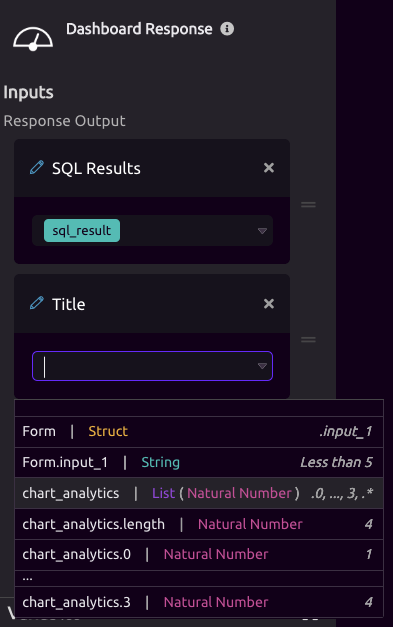

# Dashboard Response


This module requires an active [HTTP Trigger](../triggers/http-trigger.md) or [Form Trigger](../triggers/form-trigger.md) in order to work. 


## ⚙ Setup

You can add unlimited variables to your dashboard and each item will display as its own dashboard container. In order to add variables, press the **+ Add Response Output** button on the modules settings. You can set custom titles for each variable as well. 

#### Advanced

You can customize the CSS of your dashboard. 

